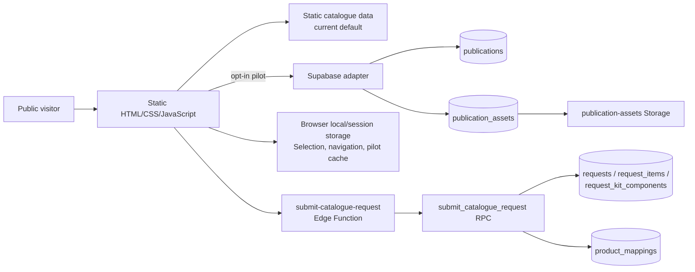
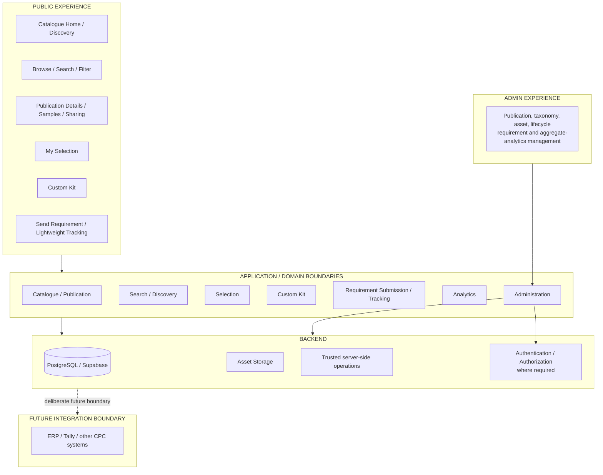
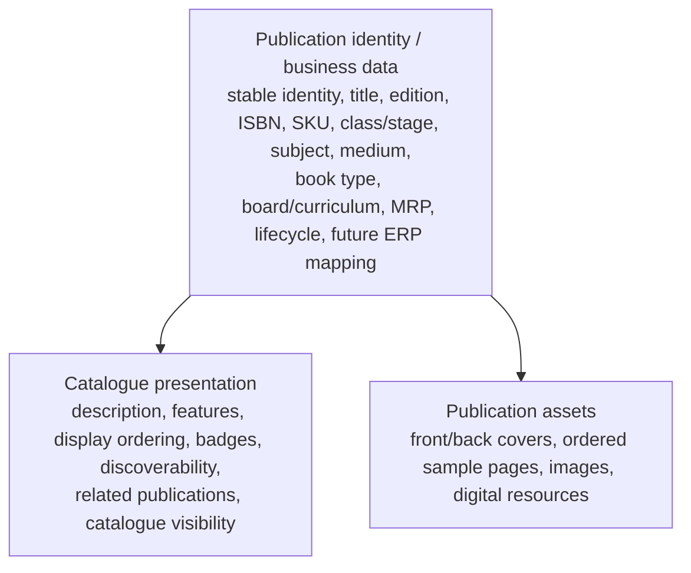
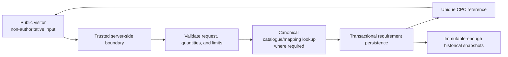
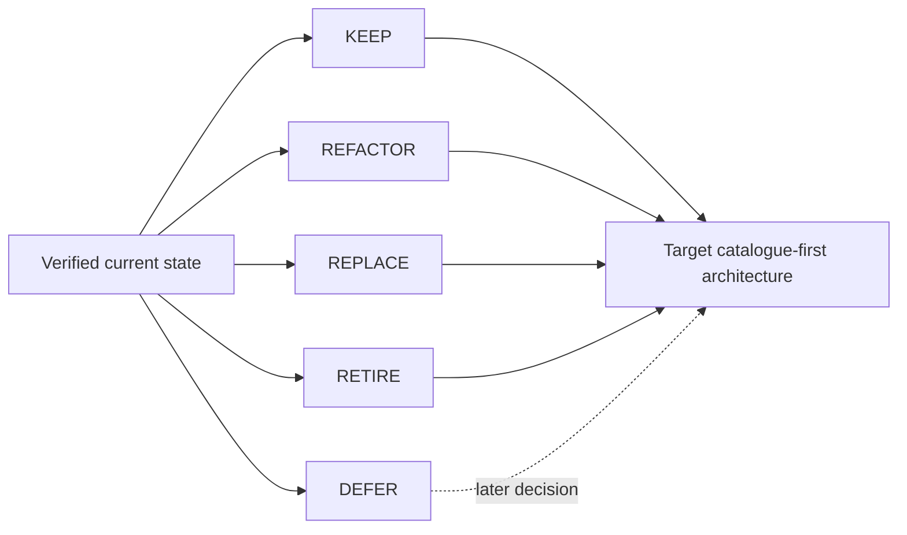

# CPC Digital Catalogue — System Architecture

## Purpose and authority

This document defines the intended system boundaries and architectural direction for the CPC Digital Catalogue. It is not a physical-schema, security-control, UI, or implementation plan.

[01-product-requirements.md](01-product-requirements.md) is authoritative for product scope. In particular, CPC Digital Catalogue is a standalone, catalogue-first product. My Selection, Custom Kit, and Send Requirement are supplementary catalogue features—not e-commerce, ordering, or ERP workflows.

## 1. Current verified architecture

### 1.1 Public experience and frontend

The current application is a static HTML, CSS, and browser-JavaScript site. Its verified public pages include Catalogue Home, Browse, Publication Details, Selection, Requirement details, and Requirement review.

`js/catalogue-data.js` remains the default catalogue source. It is a transitional, source-controlled dataset rather than the intended long-term catalogue master.

The application has a Supabase pilot path selected with `?catalogueSource=supabase`:

- `js/catalogue-bootstrap.js` loads either the static source or the pilot source and caches the pilot catalogue in `sessionStorage` for ten minutes.
- `js/catalogue-supabase-adapter.js` reads active `publications` and active `publication_assets`, then adapts them to the existing browser catalogue contract.
- Existing page-level rendering and navigation use shared query and selection utilities but remain substantially page-script based.

My Selection is persisted locally under `localStorage` key `cambridgeOrder`. Short-lived return/navigation context and the Supabase pilot cache use `sessionStorage`. This is current browser-state handling, not a customer account or server-side selection service.

Cambridge Standard Kit definitions use a small browser-local CPC configuration contract (`stageCode`, optional display name, enabled state, and ordered canonical publication IDs). It resolves only against the selected normalized catalogue source; the current real definitions are intentionally unconfigured until CPC supplies approved compositions.

### 1.2 Verified catalogue backend

Supabase is the selected managed backend platform. PostgreSQL is the relational database.

Recovered metadata verifies these public tables:

- `publications` — UUID-based publication records;
- `publication_assets` — multiple assets per publication;
- `product_mappings` — legacy/operational mapping bridge with optional `publication_id`;
- `requests` — submitted requirement headers and customer information;
- `request_items` — submitted book/custom-kit/standard-kit lines;
- `request_kit_components` — normalized submitted kit-component records.

All six tables have RLS enabled. Current public read policies allow `anon` and `authenticated` users to read only active publications and active assets associated with active publications. No public policies were recovered for request or operational-mapping tables.

The recovered `publication-assets` Storage bucket is public, allows JPEG, PNG, WebP, and PDF, and has a 10 MiB file limit. It is a current asset-delivery capability, not a requirement that every publication have Storage assets.

### 1.3 Verified requirement boundary

The deployed `submit-catalogue-request` Edge Function accepts public POST submissions, performs basic request-shape and size checks, uses server-side Supabase environment variables, and invokes the `submit_catalogue_request(payload jsonb)` database routine.

That routine is a `SECURITY DEFINER` transactional boundary. It validates core item/quantity rules, generates a CPC reference, records header/items/components, and preserves submitted snapshots. It looks up internal mapping data server-side where applicable.

This is a useful current boundary, but it is transitional rather than the complete target security design. The recovered rate-limit helper is not called by the recovered Edge Function or submission routine. The current flow also has no verified CAPTCHA or idempotency design.

### 1.4 Current architecture diagram



## 2. Target architecture

### 2.1 High-level architecture

The target remains a practical, catalogue-first system. Supabase/PostgreSQL is the authoritative Digital Catalogue publication master for now. This decision may be revisited if CPC later adopts a mature ERP or other system of record; the application must not be designed around an ERP that does not yet exist.



### 2.2 Responsibilities and boundaries

| Boundary | Responsibility | Must not become |
| --- | --- | --- |
| Public experience | Discovery, information, samples, Selection, Custom Kit, Standard Kit, and requirement initiation | An ordering/checkout portal |
| Catalogue / Publication | Customer-safe publication data, lifecycle, presentation, and asset references | A UI-specific hard-coded book list |
| Search / Discovery | Search, filters, categories, and no-result handling over catalogue data | A permanently fixed page-level array search |
| Selection | Publication references, quantities, and needed catalogue context | A shopping cart or reservation system |
| Custom Kit | Kit identity, component references, quantities, and submitted snapshot integrity | An ERP bill of materials |
| Requirement Submission | Trusted validation, canonical lookup where needed, transactional persistence, reference generation | Order placement or fulfilment |
| Requirement Tracking | Lightweight reference/status communication | Full order management |
| Administration | Authorized catalogue and operational management | A public capability |
| Analytics | Privacy-conscious aggregate catalogue insights | A prerequisite for catalogue operation or surveillance system |
| Future integration | Deliberate data/interoperability boundary | A present-day ERP dependency |

### 2.3 Catalogue and publication domain

Publication identity is a CPC/domain concept, not a provider-specific concept. It must remain stable while display, price, assets, and lifecycle information change.



This is conceptual separation only. It does not require a separate physical table for each concept. The physical schema belongs in `06-database-schema.md`.

Catalogue content must be data-driven. Adding or changing publications, classifications, MRP, lifecycle state, covers, and samples must normally be a catalogue-data operation rather than a source-code change. Presentation changes—cards, layout, navigation, typography, colours, filters, and details pages—must be separable from business data.

### 2.4 Selection and Custom Kit

My Selection is an independent domain capability containing publication references, quantities, and needed catalogue context. It supports review, quantity changes, Custom Kit/Standard Kit compatibility where applicable, and Send Requirement now. Sharing is deferred; no ordering behaviour is implied.

Custom Kit is a first-class catalogue capability and an Early Learning differentiator, not a catalogue-wide feature. It currently applies only to eligible Playgroup, Nursery, LKG and UKG publications/configurations. Eligibility must be data-driven/configurable rather than permanently derived from the displayed stage; other catalogue sections retain normal catalogue, My Selection and Send Requirement capabilities but do not automatically receive Custom Kit.

A kit must preserve session/context identity, component publication references, quantities where applicable, and an immutable-enough snapshot when submitted as a requirement. Custom Kits may be reviewed/edited and optionally named; Standard Kits are CPC-defined and non-editable. Sharing/downloading are deferred. No ERP kit/BOM behaviour is required.

### 2.5 Requirement trust boundary



The public client must not be trusted as the authoritative source of publication identity, mapping, or operational data. Historical requirement snapshots must remain sufficient to explain what was submitted at that time. Lightweight status lookup may be supported without creating a full customer account or order-management system.

### 2.6 Security, privacy, analytics, and failure isolation

Trust boundaries are explicit:

- **Public:** anonymous browsing and anonymous requirement submission.
- **Trusted server:** validation, protected operations, canonical lookup, and transactional persistence.
- **Admin:** authenticated CPC staff performing authorized management actions.
- **Database/Storage:** RLS/authorization, least privilege, and protection of operational/customer data.

Frontend controls are never authorization. Detailed controls and threat modelling belong in `07-security-design.md`.

Analytics is separate from core catalogue operation. Catalogue engagement analytics, operational/security telemetry, and personally identifiable requirement data must not be conflated. Analytics failure must not prevent browsing, searching, publication viewing, samples, Selection, Custom Kit, or requirement submission. Anonymous/aggregate collection is preferred; anonymous browsing must not require identity.

Failures in optional capabilities degrade gracefully: missing samples/assets use a fallback, unavailable requirement submission does not affect browsing, unavailable analytics does not affect the catalogue, and unavailable administration does not take down public discovery.

### 2.7 Search, performance, and scale

Search/discovery operates on catalogue data and supports title, series, class/stage, subject, medium/language, ISBN, and justified additional classifications. PostgreSQL-based search may be sufficient initially; a dedicated search platform is not selected prematurely.

The target supports hundreds or thousands of publications, multiple optional assets, responsive mobile use, pagination/filtering/search, and optimized/lazy asset delivery. It should evolve with measured demand rather than overengineer for hypothetical massive scale.

### 2.8 Admin Console

The Admin Console is a separate trust boundary. Controlled Supabase/import processes may continue during development and pre-launch. A later secure Admin Console may manage publications, taxonomy, assets, samples, lifecycle, requirements, and aggregate analytics. It is not built by this architecture document.

### 2.9 Data ownership now

For now:

- Supabase/PostgreSQL is intended to own authoritative Digital Catalogue publication data, asset metadata, catalogue lifecycle/presentation information, requirements, and necessary catalogue application data after final cutover. The current project is development/pilot; static data remains a development/reference/fallback source.
- Supabase Storage owns catalogue assets as appropriate.
- Future ERP ownership is deliberately undecided until such a system exists.

## 3. Future possibilities

The following are possibilities, not current requirements or commitments:

- a secure Admin Console for routine CPC operations;
- sharing a Selection or Custom Kit;
- lightweight requirement-status lookup;
- a separate ERP-integrated ordering portal reusing catalogue publication data;
- selective future extension of catalogue capabilities if product scope is approved;
- deliberate mappings among catalogue UUID, SKU, ISBN, Tally identifier, and ERP identifier;
- a dedicated search service only if PostgreSQL-based search no longer meets measured needs.

Two future directions remain open:

```text
Option A: Publication/ERP ecosystem
  Digital Catalogue + separate ERP-integrated Ordering Portal

Option B: Digital Catalogue
  selectively extended/integrated with ordering capability
```

Neither option makes ERP the current catalogue master or authorizes e-commerce scope today.

## 4. Current-to-target transition



| Action | Evidence-based direction |
| --- | --- |
| **KEEP** | UUID publication identity; `publication_assets` concept; the `product_mappings` bridge; transactional requirement boundary; normalized request kit components; active-only public catalogue RLS pattern; Storage as an optional asset capability. |
| **REFACTOR** | Static/default catalogue transition; page-level rendering duplication; adapter contract; client-controlled requirement snapshots; submission validation, rate limiting, anti-spam, and idempotency; broad grants/default ACLs. |
| **REPLACE** | Static hard-coded catalogue data as the long-term source of truth; scattered direct data access in UI code where it prevents clear application/data boundaries. |
| **RETIRE** | Transitional static catalogue source only after the data-driven catalogue is complete, verified, and safely cut over; legacy mapping assumptions only after historical compatibility is deliberately resolved. |
| **DEFER** | Admin Console; detailed edition model; formal requirement tracking; ERP/Tally integration; customer accounts; dedicated search infrastructure; ordering capabilities. |

## 5. Architectural non-goals

The target architecture does not currently build:

- e-commerce checkout or payments;
- an ERP, inventory reservation, dealer/school pricing engine, invoice, dispatch, or shipping system;
- a full customer account portal;
- microservices, Kubernetes, or speculative high-scale distributed systems;
- dedicated search infrastructure unless justified later;
- unnecessary provider-abstraction frameworks.

Practical separation is preferred: UI components should not scatter direct database logic, catalogue querying should pass through clear application/data boundaries, and domain rules should avoid unnecessary Supabase-specific coupling. This does not require elaborate abstractions.

## 6. Architecture decision principles

1. Catalogue first.
2. Data-driven content.
3. Stable domain identity.
4. Separation of data, domain logic, and presentation.
5. Clear trust boundaries.
6. Privacy by design.
7. Least privilege.
8. Optional features degrade gracefully.
9. Simple architecture appropriate to current scale.
10. Future interoperability without building future systems now.
11. Avoid irreversible coupling where practical.
12. Existing implementation does not automatically define target design.

## Document status

Status: Initial approved target architecture baseline
Date: 2026-09-29

Product authority: [docs/01-product-requirements.md](01-product-requirements.md)

This architecture document defines the intended system boundaries and direction. Detailed physical schema, security controls, UI design, and implementation sequencing belong in their respective project documents.
