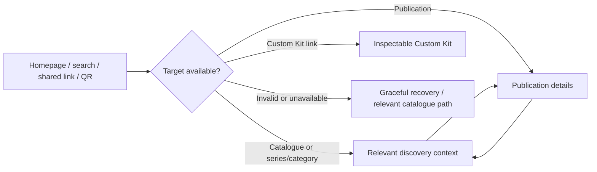
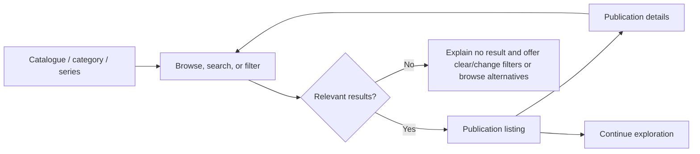
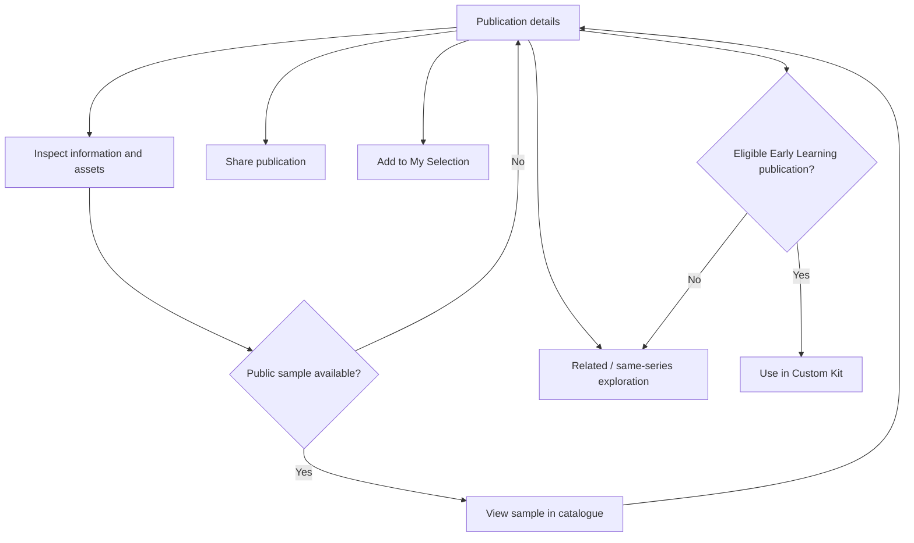
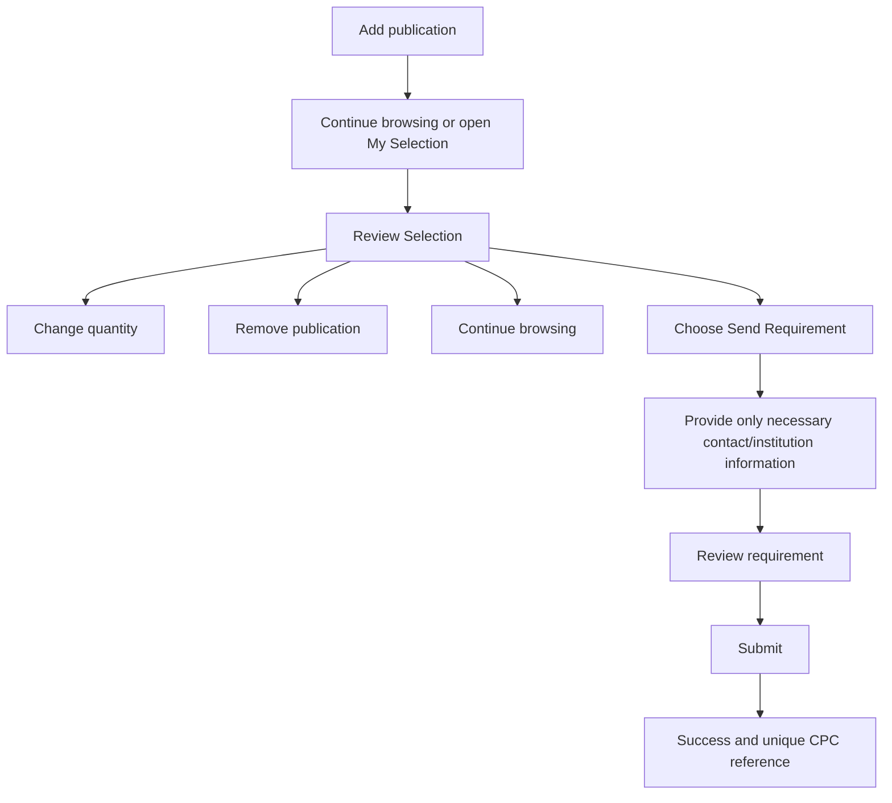
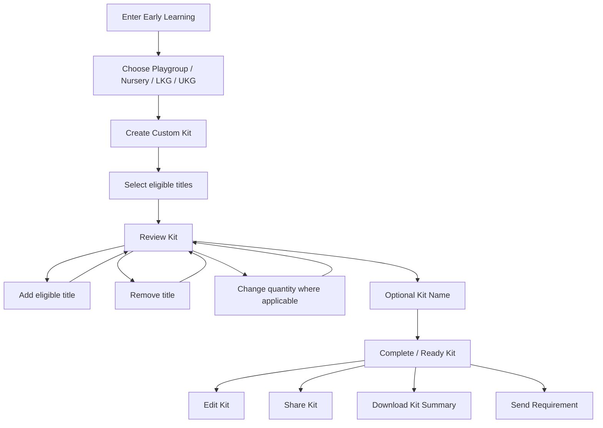
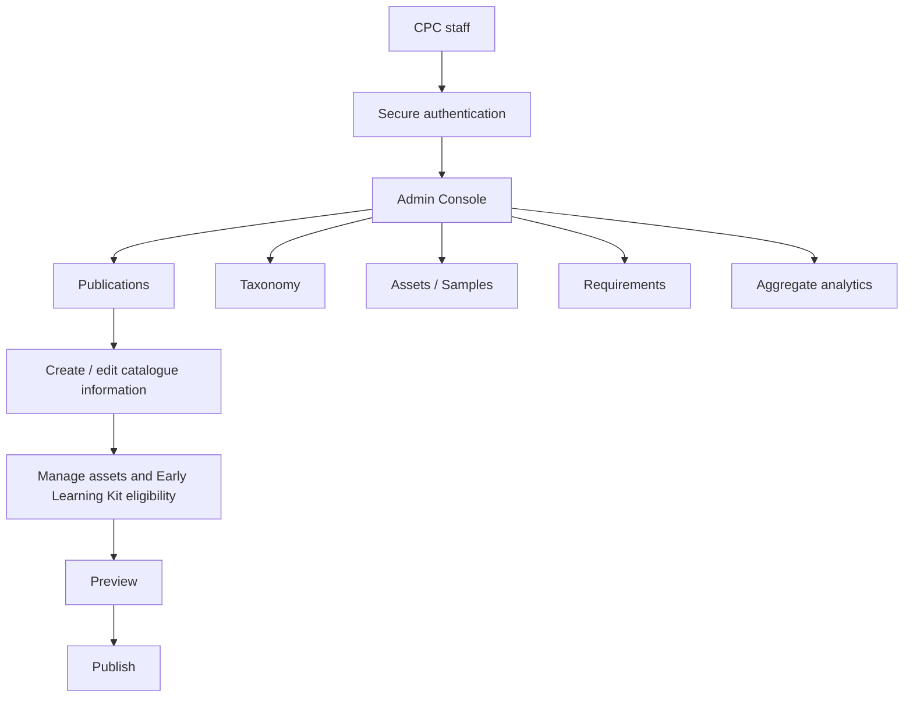

# CPC Digital Catalogue — User Flows

## Purpose and flow principles

This document defines behavioural journeys, not final screens or technical implementation. [01-product-requirements.md](01-product-requirements.md) is the product authority and [02-system-architecture.md](02-system-architecture.md) is the architecture authority.

The broad journey is:

```text
Discovery → Exploration → Optional Engagement → Optional Intent
```

- Digital Catalogue first; browsing alone is a successful session.
- There is no mandatory purchase or conversion funnel, login, or forced contact collection for browsing or public samples.
- My Selection is not a cart. Send Requirement is not Place Order.
- Custom Kit is Early Learning-specific, not catalogue-wide.
- Direct links and QR codes are first-class entry paths.
- Visitors can leave or continue browsing at natural points.
- Privacy and data minimisation apply throughout; wording must not imply e-commerce.

## 1. Entry flows — CORE / LAUNCH

Visitors may arrive through the catalogue homepage/direct visit, a search engine, WhatsApp or another shared link, a QR code, a direct publication link, or a direct series/category link where supported.



A direct publication, series/category, or kit visitor must not be forced through the homepage or category hierarchy. Direct links should retain useful context and permit normal catalogue exploration.

## 2. Browse and discovery — CORE / LAUNCH

Visitors may browse relevant classifications, search, apply one or more appropriate filters, change or clear filters, use pagination/load-more behaviour where needed, recover from no results, open details, and continue exploration. Discovery dimensions may include series, class/stage, subject, medium/language, book type, board/curriculum, title, ISBN, and justified catalogue classifications. Exact controls are a UI decision.



No-result recovery should retain the visitor's agency and avoid forced contact collection.

## 3. Publication exploration — CORE / LAUNCH

Publication details may support inspecting catalogue information and available assets, viewing a sample where available, sharing the publication, adding it to My Selection, exploring related/same-series publications where available, and continuing browsing.



No broken sample action is shown when no public sample exists. Samples return visitors to the relevant publication/catalogue context. Public sample viewing requires no login or contact information; permitted downloading is a separate CPC decision.

## 4. My Selection and Send Requirement — CORE / LAUNCH



Adding a title does not collect contact details. Selection may initially persist locally on the visitor's device, subject to later privacy/technical design. Send Requirement is optional and never changes Selection into checkout.

Requirement behaviour:

- necessary contact/institution information only;
- review before submission;
- unique CPC reference after success, usable when contacting CPC;
- no payment, checkout, discounts, stock reservation, or commercial/order processing;
- on failure, preserve or recover work where reasonably possible;
- server-side validation is required conceptually, with details deferred to security/technical design.

## 5. Early Learning Custom Kit — CORE / LAUNCH

Custom Kit is a first-class Early Learning USP. It applies only to CPC-eligible Playgroup, Nursery, LKG, and UKG publications/configurations. Eligibility is conceptually data-driven/configurable; it must not be permanently hard-coded merely from a displayed stage name. Other classes and catalogue sections do not automatically receive Custom Kit functionality.



A normal temporary kit requires no account. The recipient of a shareable kit should be able to inspect it and navigate to relevant catalogue publications. Kit sharing and downloading do not require Send Requirement. A kit summary is deliberately generated branded content, not necessarily a browser screenshot; exact PDF/image/both sequencing is **TO BE CONFIRMED** in UI/Technical Design.

## 6. Requirement tracking — PLANNED

Lightweight tracking may allow a visitor to use a reference to see limited, safe status information such as **Received**, **Under Review**, **Contacted**, or **Closed**. It must not expose another customer's requirement and must not use order-language such as Processing Order, Packed, Dispatched, or Delivered. Verification and access controls belong in Security Design.

## 7. Sharing and download

### Publication sharing — CORE / LAUNCH

Share a stable publication/direct link, including through WhatsApp and other standard mobile sharing paths. The recipient lands in the relevant catalogue context rather than an isolated dead end.

### Custom Kit sharing — approved direction; release sequencing TO BE CONFIRMED

Share a completed/reviewed Early Learning kit link that preserves enough information to safely reconstruct the intended kit for inspection and catalogue exploration. It does not submit a requirement or create an order.

### Custom Kit download — approved direction; release sequencing TO BE CONFIRMED

```text
Completed/Reviewed Custom Kit → Download Kit Summary → Generate branded summary → User saves/shares externally
```

The summary may include CPC branding, optional kit name, selected covers/titles, stage, relevant catalogue information such as MRP where appropriate, title count, and a useful catalogue URL/QR. Layout and output format are deferred; this is not a document-design system.

Series/category sharing and general My Selection sharing are **FUTURE / OPTIONAL**.

## 8. Returning visitor — CORE local continuity / FUTURE optional enhancements

Without an account, a returning visitor may retain an existing local My Selection and in-progress Early Learning Custom Kit where privacy/technical design permits. This is continuity, not behavioural profiling. Recently Viewed is **FUTURE / OPTIONAL** unless separately retained and approved.

## 9. Admin flows — PLANNED



The planned Admin Console supports creation/editing, preview-before-publish, inactivation/archival, adding/replacing samples, managing Early Learning Custom Kit eligibility, reviewing requirements, and aggregate privacy-conscious analytics. Detailed roles and permissions are deferred to Security/Admin design.

## 10. Analytics touchpoints — PLANNED

Useful anonymous/aggregate events include catalogue visit, publication viewed, search performed, zero-result search, filter used, sample viewed, publication shared, Add to Selection, Custom Kit started/completed/shared, kit-summary downloaded, requirement started/submitted, and deliberate contact action.

Analytics failure must not block any user flow. Analytics must not create surveillance or individual behavioural profiles.

## 11. Error and recovery flows — CORE / LAUNCH

| Situation | Behavioural expectation |
| --- | --- |
| No search results | Explain the result and let the visitor change/clear filters or continue browsing. |
| Missing cover or optional asset | Preserve publication access with a truthful fallback. |
| Unavailable sample | Do not offer a broken action; keep publication browsing available. |
| Inactive publication or invalid direct link | Explain gracefully and offer a relevant catalogue route. |
| Unavailable shared kit | Explain gracefully; do not imply a requirement/order exists. |
| Network or requirement-submission failure | Catalogue remains usable; preserve/recover work where reasonably possible. |
| Analytics failure | Never block the visitor. |
| Stale local Selection/Kit with inactive publication | Surface the change, preserve unaffected work where appropriate, and allow review/edit. |

## 12. Flow priority matrix

| Flow | Priority |
| --- | --- |
| Catalogue entry, browse, search/filter, publication details, direct/QR entry, responsive/mobile flow, and graceful empty/error states | **CORE / LAUNCH** |
| Public sample viewing where available; publication sharing; My Selection; Early Learning Custom Kit; Send Requirement | **CORE / LAUNCH** |
| Custom Kit sharing and kit-summary download | **Approved direction — exact launch sequencing TO BE CONFIRMED** |
| Admin Console; aggregate analytics dashboard; lightweight requirement tracking; richer related-publication behaviour | **PLANNED** |
| Favourites; shareable general My Selection; privacy-conscious richer personalisation; ERP/order-portal handoff; customer accounts | **FUTURE / OPTIONAL** |

## 13. User-flow non-goals

These flows explicitly exclude checkout, payment, online ordering, shipping, inventory reservation, invoicing, dealer pricing, school discount calculation, forced registration, forced lead forms before catalogue/sample viewing, and behavioural surveillance.

## 14. Open UX questions

- What is the clearest builder presentation for an Early Learning Custom Kit on mobile and desktop?
- Should the branded kit summary be PDF, image, or both?
- Where should Share, Sample, and My Selection actions appear in publication details?
- How should combined filters behave on mobile?
- What visual treatment best communicates unavailable optional assets without suggesting an error in the publication itself?

## Document status

Status: Initial approved user-flow baseline
Date: 2026-09-29

Product authority: [docs/01-product-requirements.md](01-product-requirements.md)

Architecture authority: [docs/02-system-architecture.md](02-system-architecture.md)

This document defines behavioural journeys and does not define final UI appearance or technical implementation.
