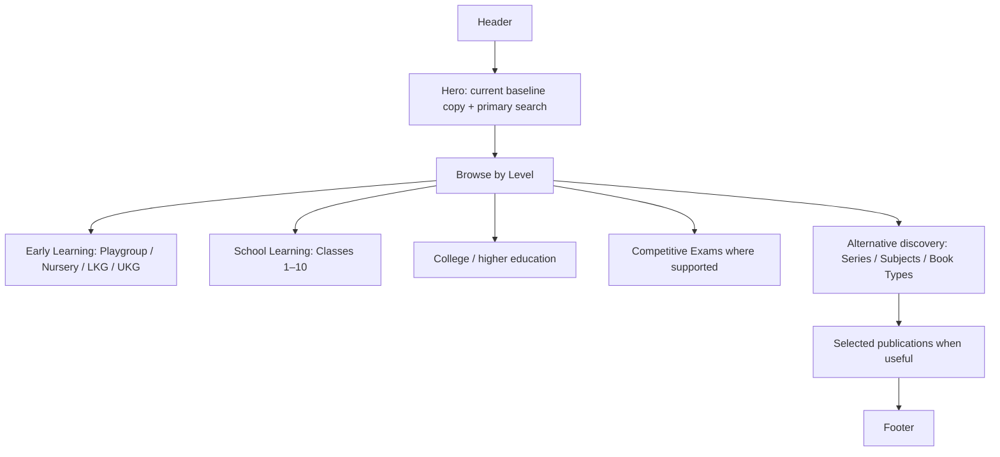
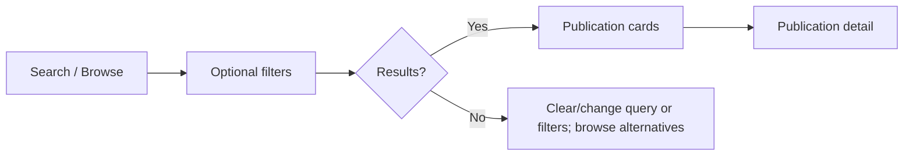
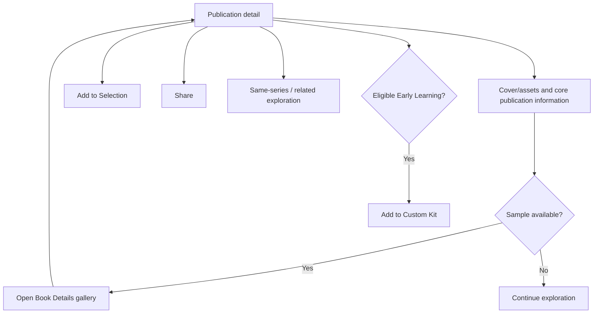
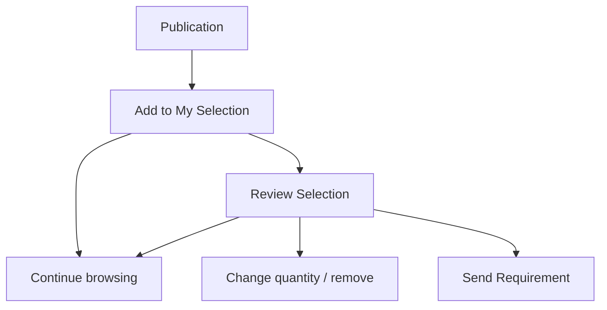
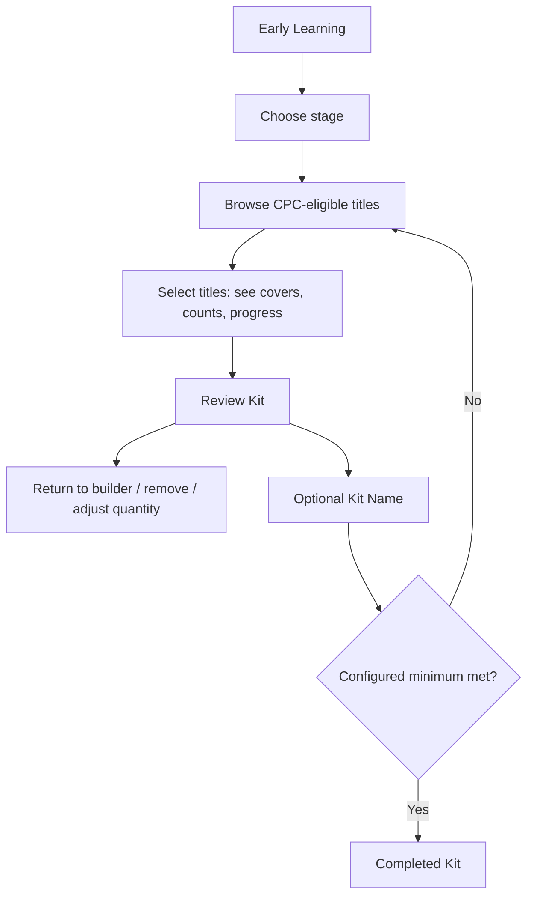
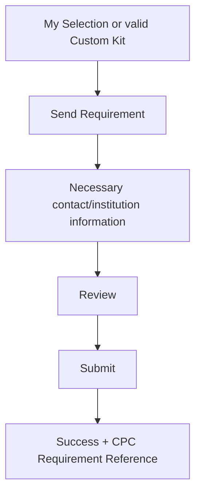

# CPC Digital Catalogue — UI/UX Specification

> Current-state update: Book Details uses one gallery (front cover → back cover → ordered sample pages), without a separate View Sample action/viewer. Browse medium/SKU/ISBN/MRP/reset controls and responsive presentation are implemented; Kit PDF/share is deferred.

## 1. Purpose and authority

This document defines the UI/UX baseline for CPC Digital Catalogue. It translates Product Requirements → System Architecture → User Flows into behavioural presentation guidance. It does not redefine product scope, database architecture, security controls, or implementation framework.

The existing Digital Catalogue is the design baseline, not an immutable product authority. The aim is to preserve and refine good information architecture and interaction patterns, not redesign the product merely to look different.

## 2. Design philosophy

The experience is a modern, premium, professional educational-publishing catalogue:

- Catalogue-first and publication-first; browsing is a successful outcome.
- Book covers and content dominate over interface decoration.
- Clear hierarchy, practical whitespace, strong readability, and progressive disclosure.
- Fast, low-friction, mobile-first/responsive, accessible, and privacy-conscious.
- No forced registration, lead capture, or behavioural surveillance.
- My Selection, Early Learning Custom Kit, and Send Requirement remain supplementary capabilities.

It must not resemble an online store, marketplace, cart, checkout, or ordering portal. MRP is catalogue information, not a payable amount.

## 3. Existing design baseline

Retain and refine current concepts where they support the product:

- prominent catalogue search and the current “Find the right book.” hero;
- Browse by Level: Early Learning, School Learning, College & University, and Competitive Exams;
- direct stage/class shortcuts;
- Browse All Series and Subjects & Book Types;
- selected/featured publications where they are backed by real catalogue data;
- contextual back navigation, publication details, responsive cards, and the floating My Selection shortcut.

Static Featured Book placeholders and non-functional actions are not an acceptable launch pattern. They should become data-driven or be omitted.

## 4. Branding and copy flexibility

**CURRENT BASELINE — SUBJECT TO PRE-LAUNCH BRAND/CONTENT REVIEW.**

Current CAMBRIDGE text treatment, the company wordmark/logo, catalogue year, hero copy, labels, section headings, buttons, and microcopy are presentation content—not permanent product architecture. For example, “Find the right book.” and “Explore our complete range of educational publications.” are approved current baseline copy, not immutable launch copy.

Implementation should centralize repeated branding/content values where practical. Changing logo, copy, colours, typography, card appearance, or homepage ordering should not require catalogue-data or business-rule redesign. A CMS is not required solely for this flexibility.

## 5. Responsive framework

Use behavioural ranges rather than permanently fixed breakpoints:

| Context | Behaviour |
| --- | --- |
| Mobile | Single-column content; prominent search; touch-first controls; compact cards; filter sheet/control; sheets or full-screen dialogs where appropriate. |
| Tablet | Two/three-column content where readable; filters may remain compact; detail layouts can progressively enrich. |
| Desktop | Wider content area, visible discovery/filter controls, multi-column cover-led cards, persistent contextual navigation. |
| Large desktop | Bounded reading/content widths; do not stretch text or cards excessively. |

Maintain readable line lengths, sensible margins, adequate touch targets, clear focus states, and reflow rather than shrunk desktop layouts. Existing responsive grid/card patterns are the starting point.

## 6. Header and global navigation

The header should remain a clean catalogue identity bar containing CPC/company identity or final logo, Digital Catalogue/year where useful, a Home route, and visible My Selection access when relevant. Mobile navigation must preserve access without becoming store-like.

Do not add commerce navigation. Header actions should prioritize discovery and context, not conversion. Final logo treatment remains subject to the pre-launch brand review.

## 7. Homepage

The hero keeps search highly prominent. Homepage taxonomy should expose meaningful entry paths but not force every dimension onto the landing page. Search, levels, series, subjects, and book types together offer multiple natural routes to discovery.

## 8. Search, browse, and filters

Search is catalogue discovery, not marketplace search. It should provide useful placeholder guidance, retain a query during the result transition where appropriate, allow clearing, and work with filters.

Desktop may show understandable filters without clutter. Mobile keeps search immediately visible and uses a compact control such as **Filters** or **Filters (3)** for detailed filters in a panel/sheet. Active filters may appear as removable chips.

Supported dimensions are data-led: stage/class, series, subject, medium/language, book type, board/curriculum, and other justified fields. The experience needs Apply, Clear, individual removal, loading, no-result recovery, and reset paths; it does not prescribe a component library.

## 9. Publication cards

Use one coherent, reusable card system across listings. Prioritize, in order: cover, title, essential classification/context, MRP where available, then appropriate catalogue actions.

- Missing cover: truthful neutral placeholder, not broken imagery.
- Missing MRP: omit the value rather than render a misleading price placeholder.
- Long title: clamp/truncate only when it preserves a clear route to full detail.
- Badges: use sparingly for meaningful information, not promotion noise.
- Desktop: cover-led discovery cards may be richer; mobile: compact horizontal cards are appropriate.
- Actions: View Details is universal; Add to Selection appears only when useful and must not overcrowd cards. Available sample pages appear in the unified Book Details gallery (Front Cover → Back Cover → ordered Sample Pages).

Hover, focus, and touch states should communicate interactivity without relying only on colour.

## 10. Publication detail and samples

Detail prioritizes cover/assets, title, series, stage/class, subject, medium/language, book type, board/curriculum where applicable, ISBN/SKU where useful, MRP, description/features, samples, and related/same-series exploration.

Action hierarchy when available:

1. View Book Details gallery
2. Add to Selection
3. Share
4. Add to Custom Kit for eligible Early Learning publications

Never show a broken or disabled sample action merely because no sample exists. An available sample opens an in-catalogue, responsive viewer with clear back/close, loading, error recovery, and sample navigation. It requires no login, contact form, or requirement submission. Viewer technology is intentionally unspecified.

## 11. My Selection

My Selection is a general catalogue shortlist, never a Cart, Basket, Checkout, or Order.

Selection remains visually supplementary to browsing. It supports review, quantity change, removal, return to catalogue, and optional Send Requirement. Contact information is not requested merely to build it. Device-local persistence is acceptable initially, subject to privacy, staleness, and recovery design.

## 12. Early Learning Custom Kit

Custom Kit is separate from My Selection: a structured, first-class Early Learning book-set builder.

Eligible stages are **Playgroup, Nursery, LKG, and UKG**. Only CPC-configured eligible publications participate. Custom Kit must not become catalogue-wide, and eligibility must not be permanently inferred from a displayed stage name.

### Minimum and incomplete-kit behaviour

The current baseline minimum is **8 eligible titles**, but it is configurable by stage and may later differ or be absent. UI language may say “Select at least 8 titles to complete your Custom Kit,” but the number/value must conceptually come from the applicable business rule.

An incomplete kit—for example, 2 of 8 selected—never loses work. The visitor may continue building, remove titles, leave, and return if persistence supports it. The working Kit remains editable, but Review and completed-kit actions remain unavailable until the configured minimum is satisfied.

Only completed-kit actions may require the configured minimum: Complete Kit, PDF summary, Share Kit, and Send as Custom Kit Requirement. Use helpful progress language such as “Add 6 more titles to complete your LKG Custom Kit.” A visitor who needs one or two individual books uses My Selection.

### Builder and review

Builder optimizes for cover recognition, quick title selection/removal, selected count, stage context, completion guidance, and mobile use. Do not overload it with final submission/share controls.

Review is distinct from building and supports covers, selected titles, quantities where applicable, removal, return to builder, optional Kit Name, and clear completion status.

## 13. Deferred Kit and sharing features

Custom Kit PDF summaries, Custom Kit sharing, and publication Share/Copy Link are deferred/post-launch. They are not launch requirements and must not add anonymous server persistence merely to support a speculative sharing flow. Existing direct publication URLs and normal catalogue navigation remain useful.

## 14. Direct links

Publication URLs should continue to support direct/QR entry, useful context, and graceful invalid/unavailable recovery. Source and return context must survive relevant catalogue journeys.

## Interaction Behaviour Contract — Accepted Baseline

This contract records accepted implementation behaviour. It supplements the product and flow documents; it does not create new scope or replace their catalogue-first principles.

### Source continuity

- Preserve the selected static/Supabase source through relevant catalogue navigation.
- Static/default navigation remains parameter-free: do not add `catalogueSource=static`.
- Direct links retain safe fallback behaviour when no valid prior context exists.

### Home search

Submitting Home search retains the query and selected catalogue source when it opens Browse.

### Book Details and browsing context

- Opening Book Details from a listing preserves the originating listing URL/context, including applicable filters, query, source, and approximate scroll position.
- Back returns to that listing context after its results render.
- After the current publication is edited during the current Details visit, Details → My Selection → Continue Browsing returns to the originating listing context.
- Without a relevant current-visit edit, Details → My Selection → Continue Browsing retains the existing Details-page return behaviour.
- A direct Details visit without a saved listing context uses a safe category/listing fallback after a successful edit.
- Navigation context must be current-book-specific and must not leak between unrelated publications.

### Early Learning Kits

- Standard Kit → My Selection → Continue Browsing returns to the relevant Early Learning stage.
- Completed Custom Kit → My Selection → Continue Browsing returns to the relevant Early Learning stage.
- Custom Kit Review → Return to Edit preserves the draft, stage, and selected catalogue source.
- Custom Kit remains a structured Early Learning feature and is distinct from catalogue-wide My Selection.

### Performance baseline

- Standard Kit starts independent catalogue and Kit-definition loading concurrently; error states remain handled.
- Owner acceptance observed approximately 2–3 seconds for an initial Standard Kit load and nearly instant subsequent loads. Custom Kit loading is currently acceptable.
- These observations are not formal mobile benchmarks, and network-request concurrency was not independently measured in browser DevTools.

### Regression expectations

Relevant regression coverage should protect source continuity, return navigation, scroll restoration, direct-link fallback, Kit draft preservation, and static fallback. Automated test results and owner browser acceptance are separate forms of evidence and must be reported separately.

## 15. Send Requirement

Send Requirement is optional intent, never checkout. Ask only necessary contact/institution information; avoid excessive lead collection. Success centers on the CPC Requirement Reference and next steps. There is no payment, stock reservation, discount calculation, delivery selection, shipping, or checkout.

Target user-facing terminology is: **My Selection**, **Send Requirement**, **Requirement Reference**, and **Custom Kit**. Legacy implementation names such as `order.html`, `ORDER_KEY`, `checkout-button`, and “order request” do not define product terminology and should be cleaned during future implementation work—not in this documentation task.

## 16. Empty, loading, error, mobile, accessibility, and privacy UX

| State | UX expectation |
| --- | --- |
| Loading/search | Explain progress without blocking navigation unnecessarily. |
| No results | Offer clear/change filters, query changes, and browse alternatives. |
| Missing cover/metadata | Use an honest fallback; keep the publication usable. |
| Unavailable sample | Omit sample action; do not show a broken control. |
| Inactive/invalid link/shared kit | Explain calmly and offer a relevant catalogue path. |
| Network/submission failure | Preserve/recover Selection, kit, and contact work where reasonably possible. |
| Stale Selection/Kit | Identify unavailable publications and preserve unaffected work. |
| Analytics failure | Never block catalogue use. |

Mobile is primary: search, filters, cards, details, the unified gallery, Selection, kit builder/review, and forms must be designed for touch targets and readable text rather than shrunk desktop layouts.

Accessibility expectations include semantic structure, meaningful headings/labels/alt text, keyboard navigation, visible focus, accessible dialogs, announced form errors, contrast, non-colour indicators, and screen-reader-friendly controls. This document does not claim formal certification.

Privacy is data minimisation in the interface: browsing, samples, Selection, and temporary kit creation need no identity; personal data is requested only for Send Requirement or another justified action. No surveillance, behavioural profiling, or unnecessary fingerprinting.

## 17. Analytics UX

Analytics is deferred/post-launch. It must not block any visitor flow or expand personal-data collection without a separate privacy decision.

## 18. Visual system and maintainability

| Direction | Guidance |
| --- | --- |
| **KEEP** | Existing navy/white/soft-grey editorial palette, generous spacing, rounded surfaces, restrained shadows, cover-led discovery, strong headings, compact mobile cards. |
| **REFINE** | Small-text density, card/action consistency, filter presentation, empty/loading states, focus/error states, and homepage featured content. |
| **STANDARDIZE** | Typography scale, colours, spacing, content widths, radii, shadows, button/input/chip/badge patterns, dialog/sheet behaviour, icons, breakpoints, and brand asset references. |

Centralize repeated presentation values where practical. Do not introduce a framework solely for tokenization or visual consistency.

## 19. Screen inventory and priority

| Experience | Priority |
| --- | --- |
| Homepage; Browse/Search; Publication Detail gallery; My Selection; Early Learning Custom Kit Builder; Custom Kit Review; Send Requirement; Requirement Success; error/empty states | **CORE / LAUNCH** |
| CPC-branded Custom Kit PDF Summary; Custom Kit Share; publication Share/Copy Link | **DEFERRED / POST-LAUNCH** |
| Admin Console; Requirement Tracking; Aggregate Analytics Dashboard | **DEFERRED / POST-LAUNCH** |
| General Selection sharing, favourites, customer accounts, richer privacy-conscious personalisation, ERP/order-portal handoff | **FUTURE / OPTIONAL** |

## 20. Future resilience and interoperability

Normal UI changes—new logo, hero copy, catalogue year, typography, colour refinement, cards, labels, or homepage order—do not require database redesign. Likewise, a future Kit minimum change from eight to another value does not require rebuilding Custom Kit.

The catalogue remains useful independently. A future ERP-connected ordering portal may integrate with, hand off from, or reuse concepts from the catalogue, but this UI must not prematurely resemble that portal.

## 21. Open UI questions

- What is the final pre-launch logo/header treatment?
- What final hero copy best represents CPC at launch?
- What mobile filter presentation performs best after prototype testing?
- What final publication-card density is appropriate once complete live catalogue data is available?

## Document status

Status: Initial UI/UX baseline

Date: 2026-09-29

Product authority: [docs/01-product-requirements.md](01-product-requirements.md)

Architecture authority: [docs/02-system-architecture.md](02-system-architecture.md)

Behavioural authority: [docs/03-user-flows.md](03-user-flows.md)

Existing frontend: design/implementation baseline, not immutable product authority.
