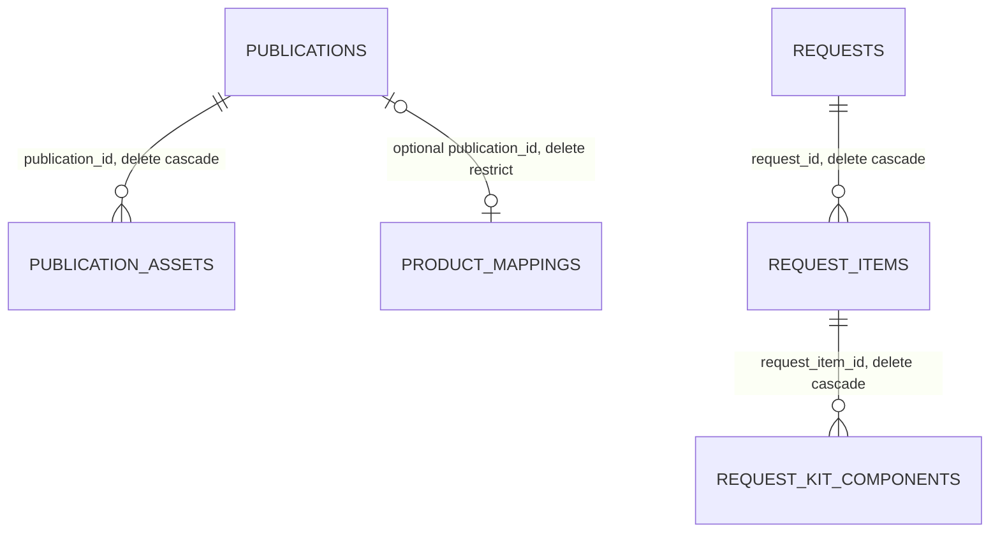
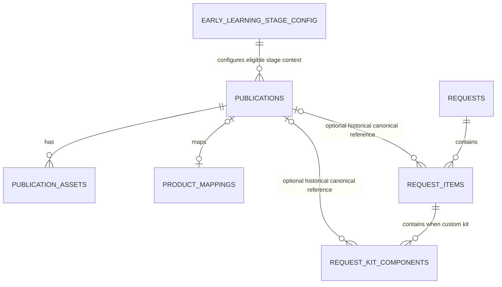

# CPC Digital Catalogue — Database Schema

## Purpose and authority

This document defines the target logical and physical data model for CPC Digital Catalogue. It distinguishes recovered live-state evidence from the intended target model and from deliberately deferred possibilities. It is not migration SQL, an implementation plan, or authorization-policy code.

Product scope is governed by [01-product-requirements.md](01-product-requirements.md), system boundaries by [02-system-architecture.md](02-system-architecture.md), behaviour by [03-user-flows.md](03-user-flows.md), and UI/UX direction by [04-ui-ux-specification.md](04-ui-ux-specification.md). The current-schema section is grounded in `supabase/recovery/` and the recovered `submit-catalogue-request` Edge Function, not production rows or older planning documents.

## 1. Database principles

**Prepared / pending pilot deployment:** migration `20261005000000_harden_requirement_submission.sql` prepares canonical Requirement validation, configurable Kit rules, Standard Kit request-type support, idempotency, explicit Kit-configuration RLS/grants, and restricted RPC execution. It is repository-local after `0f5bc96` and is not current remote database state. For controlled pilot deployment, hold Requirement submissions, apply the migration, deploy the matching Edge Function immediately, run one synthetic submission, then reopen the flow.

- PostgreSQL is the current relational database and Supabase is the current managed backend.
- Supabase/PostgreSQL is intended to become CPC's authoritative Digital Catalogue publication master; the current remote project is development/pilot and static data remains a development/reference/fallback source during cutover.
- Requirement submission accepts only canonical Supabase publication UUIDs. Static fallback records remain browse-only and are not silently title-mapped into Requirement submissions.
- A generated, stable publication UUID is the durable CPC catalogue identity. It is distinct from display text and external operational identifiers.
- Catalogue data must be independent of UI layout. Normal publication, taxonomy, price, lifecycle, and asset changes are data operations, not frontend changes.
- Use foreign keys and explicit constraints for durable business invariants; avoid encoding presentation-only assumptions as permanent constraints.
- Apply least privilege and RLS to exposed data. Protected writes, customer information, and internal mappings require a trusted server-side boundary.
- Preserve submitted requirement snapshots where needed to explain historical submissions, while minimising unnecessary duplicate PII.
- Do not create speculative ERP, e-commerce, pricing, inventory, or generic rules-engine structures.
- Design for hundreds or thousands of publications and their assets, not an imagined marketplace at massive scale.

## 2. Current verified schema

Recovery evidence lists six `public` base tables, no recovered views/materialized views, and no recovered database enums. All six tables have RLS enabled (not forced).

### 2.1 Current tables and key columns

| Table | Verified purpose and principal columns | Current decision |
| --- | --- | --- |
| `publications` | UUID `id`; section, series, title, `class_stage text[]`, subject, medium, language position, book type, optional SKU/ISBN/MRP, author/bibliographic dimensions, status, description, timestamps. | **MODIFY** |
| `publication_assets` | UUID `id`; required publication UUID, asset type, required URL, optional label/storage path, sort order, primary/active flags, timestamps. | **MODIFY** |
| `product_mappings` | Legacy text `product_id` primary key; optional SKU/ISBN/Tally/ERP fields/internal notes; active/timestamps; optional UUID `publication_id`. | **MODIFY** |
| `requests` | UUID `id`, unique reference, status, contact/institution fields, counts, notes, timestamps, customer fields and `customer_snapshot jsonb`. | **MODIFY** |
| `request_items` | UUID line, request UUID, position, book/custom-kit type, legacy product identifiers, catalogue snapshot fields, quantity/MRP, `kit_books jsonb`, full snapshot, internal mapping snapshot, mapping status. | **MODIFY** |
| `request_kit_components` | UUID component, parent request item UUID, position, legacy product identifier/title, quantities, full snapshot, internal mapping snapshot, mapping status. | **KEEP, then MODIFY** |

`publications` has UUID generation and non-null section, title, class-stage array, book type, lifecycle status, and timestamps. It currently uses a non-null empty `text[]` default for an intentionally unrestricted class/stage. This is useful semantics and should be retained.

Current `publication_assets` permits `cover`, `back_cover`, `sample_page`, `sample_pdf`, `sample`, `digital_resource`, and `other`. It has a unique partial index that permits only one active primary asset of each type per publication.

### 2.2 Verified relationships, constraints, and indexes



Verified primary keys are each table's UUID except `product_mappings(product_id)`. `product_mappings.sku`, `requests.reference`, request line position per request, and kit component position per request item are unique. `product_mappings.publication_id` is unique when present.

The recovered checks include non-negative MRP; positive bibliographic dimensions/pages where supplied; restricted current section, medium, language position, book type, and publication status vocabularies; asset type/URL/sort order; quantity and position limits; valid request item/kit combinations; request status; and length limits for relevant text fields.

Useful recovered indexes include section, series, subject, book type, status, ISBN, unique non-null SKU, and a GIN index on `publications.class_stage`; publication-asset lookup, primary-asset, and storage-path indexes; request reference/status/created-at and foreign-key indexes; mapping lookup; and request-kit-component/mapping indexes. No separate publication full-text or trigram index was recovered.

### 2.3 Current RLS, grants, routines, triggers, and Storage

All six public tables have RLS enabled. The only recovered public policies are SELECT policies for `anon` and `authenticated`:

- active publications (`status = 'Active'`); and
- active publication assets belonging to active publications.

No recovered public policy exposes requests, request items, kit components, or mappings. However, recovered table/default ACL metadata is broad for `anon` and `authenticated`; RLS currently limits ordinary row access, but grants and defaults require a deliberate least-privilege review rather than being treated as safe by themselves.

Recovered routines:

- `submit_catalogue_request(payload jsonb)` is `SECURITY DEFINER`, inserts request header/lines/components transactionally, generates `CPC-YYYYMMDD-XXXXXX` references, and snapshots browser payload plus mapping data.
- `check_catalogue_request_rate_limit(ip, limit, window)` is `SECURITY DEFINER`; its definition deletes expired private attempts and inserts a new attempt. It is not read-only, references a private table not in recovery, and was not found called by the recovered submission routine or Edge Function.
- `set_catalogue_updated_at()` is a normal trigger function. It is used before updates on `publications` and `publication_assets`.

Routine grants recovered for the two `SECURITY DEFINER` routines are limited to `postgres` and `service_role`; default ACL evidence still warrants review before any future routine is introduced. The Edge Function invokes the submission routine using server-side Supabase environment variables; it does not download rows or expose a service key to the browser.

The verified `publication-assets` Storage bucket is public, has a 10 MiB size limit, and permits JPEG, PNG, WebP, and PDF. No Storage policies were recovered; storage-object RLS is enabled. The public bucket setting is delivery metadata, not proof that every stored object or policy configuration is appropriate.

## 3. Target publication master

The target evolves `publications`; it does not replace the UUID-based master.

| Domain boundary | Target responsibility | Examples |
| --- | --- | --- |
| Publication/business identity | Stable public catalogue entity and durable bibliographic meaning | UUID, title, edition information when verified, ISBN, SKU where authoritative, lifecycle |
| Catalogue classification | Controlled discovery/filter values | section, class/stage, series, subject, medium/language, book type, board/curriculum where applicable |
| Catalogue presentation | Customer-safe content and discoverability | description, features, display order, featured/new flags, visibility |
| Operational mapping | Internal external-system references, never public catalogue authority | legacy product id, Tally, future ERP identifiers |

The target keeps the current core title/section/class-stage/subject/medium/book-type/MRP/ISBN/bibliographic fields and timestamps. It should add only confirmed needs: a clear catalogue-visibility/lifecycle interpretation; optional edition/academic-year information when CPC confirms its business identity rules; customer-safe feature bullets if required; and an explicit Custom Kit eligibility flag. No field is added merely for a proposed UI label.

### Taxonomy recommendation: controlled hybrid

For present CPC scale, retain controlled text values for `catalogue_section`, `book_type`, `medium`, `language_position`, and status, plus `class_stage text[]` where a title genuinely spans multiple stages. Maintain approved vocabularies through controlled import/Admin validation. This preserves current filtering and avoids a table for every label.

Add a small `early_learning_stage_config` table because Early Learning Kit rules require data-managed stage identity and configuration. Defer general lookup tables for series, subject, medium, book type, and board/curriculum until routine staff taxonomy management, aliases, localised labels, or relationships make them worthwhile. This is simpler than fully normalising every taxonomy label while avoiding spelling variants through validation.

## 4. Early Learning Custom Kit configuration

### 4.1 Eligibility

Add nullable `publications.custom_kit_eligible boolean` as an explicit publication capability. `false` explicitly excludes a title; `null` preserves compatibility for existing records and remains eligible when its selected configured Early Learning stage permits it. It must be evaluated with a selected configured Early Learning stage, not inferred only from a displayed stage label. At submission, the trusted server canonicalises each UUID against the publication master, confirms it is active/catalogue-visible, eligible, and applicable to the selected Early Learning stage.

This deliberately does not add a generic kit/BOM table. A publication may remain associated with one or more `class_stage` values; a configured early-stage record establishes which stage codes are eligible kit contexts.

### 4.2 Minimum configuration

Add `early_learning_stage_config` as the smallest durable configuration structure:

| Key column | Meaning |
| --- | --- |
| `stage_code` (PK) | Stable configured stage identifier; initially Playgroup, Nursery, LKG, UKG. |
| `display_name` | CPC-maintained display label. |
| `custom_kit_enabled` | Enables the Kit experience for that stage. |
| `minimum_distinct_titles` (nullable integer) | Current value 8; null means no configured minimum. |
| `active`, timestamps | Retire/configure safely without deleting history. |

Constraints should permit a positive minimum or null, not hard-code eight. Submission validation counts distinct canonical eligible titles (not quantities) and enforces the applicable active-stage rule only for a completed Custom Kit requirement. An incomplete local kit remains valid browser work; it requires no database row.

## 5. Assets and samples

`publication_assets` remains the one-to-many asset metadata table. It can represent ordered `sample_page` images, a single/multiple `sample_pdf` asset as permitted, primary cover/back cover, additional images, and future approved resources. Extend it rather than creating a separate sample table.

Target changes are:

- retain asset type, label, sort order, active state, primary flag, timestamps, and publication foreign key;
- retain `storage_path` for Storage-owned files;
- replace the current mandatory generic `url` over time with a nullable verified `external_url`/delivery reference strategy so a storage path can be authoritative without duplicated mutable URLs;
- add only rendering metadata actually needed, such as media type and customer-safe alternative text when assets are presented as images;
- require exactly one usable source: a valid Storage path or approved external URL; do not store binary data in PostgreSQL.

The database stores metadata; Supabase Storage stores files. Public delivery should be restricted to appropriate active public catalogue assets. Administrative upload and object policy design belongs in Security Design. Missing optional assets never invalidate a publication.

## 6. Product mappings and identifiers

`product_mappings` is a **KEEP/MODIFY** compatibility bridge, not the catalogue master. Retain its ability to map legacy `product_id`, Tally identifiers/names, and future ERP identifier to a canonical `publication_id`. Keep operational mapping fields private.

Target direction is to make `publication_id` the primary operational relationship wherever safe, while retaining legacy `product_id` only for historical compatibility and controlled migration. Do not duplicate the canonical public SKU/ISBN in both masters unless a snapshot/legacy integration requires it; resolve disagreement through data governance rather than silently choosing a value.

Identifier semantics:

- `publications.id`: immutable UUID and CPC catalogue identity.
- ISBN: optional public bibliographic identifier; uniqueness only when CPC confirms how multi-edition/format cases behave.
- SKU: optional CPC operational/public identifier; uniqueness when populated and governed.
- `product_mappings.product_id`: legacy mapping identity, not a replacement UUID.
- Tally/ERP identifiers: optional private mappings, not today's publication master.

## 7. Selection, working Kits, and requirements

### 7.1 Local state first

No server-side Selection table is needed for launch. My Selection may remain device-local until deliberate requirement submission. Likewise, an anonymous in-progress Custom Kit may remain local; this preserves privacy and avoids persistence just because it might later be useful.

Shareable general Selection and server-persisted Custom Kit links are **DEFERRED**. They need expiry, anti-enumeration, integrity, retention, and access design before any table is justified. Custom Kit PDF output is also deferred; neither feature requires a persisted Kit record today.

### 7.2 Requirements are historical submissions, not orders

Retain `requests`, `request_items`, and normalized `request_kit_components`. They model a requirement header, top-level selected book/kit lines, and kit components. Do not add payments, commercial pricing, discount, stock, shipment, invoice, or fulfilment tables.

Target request header retains UUID, unique human reference, created-at, simple status, necessary contact/institution information, notes, and server-derived item/quantity counts. Target statuses should be constrained to the product vocabulary **Received**, **Under Review**, **Contacted**, and **Closed** (with a deliberate cancellation state only if required). Existing `new/reviewing/accepted/rejected/cancelled` are legacy/current values requiring an explicit mapping before change; no order fulfilment status is introduced.

Target request-item fields include nullable canonical `publication_id uuid` for a book, position, type, quantity, and a whitelisted snapshot of customer-facing title/series/stage/subject/medium/ISBN/SKU/MRP as justified. For a Kit line include stage code, optional Custom Kit name where applicable, line quantity, and a snapshot. The current remote schema supports book/custom-kit; the prepared pending migration adds `standard-kit` compatibility. A Standard Kit submission requires an enabled CPC definition whose ordered canonical IDs exactly match the submitted components; no definition is seeded. Keep a strict book-vs-kit check and unique positions.

`request_kit_components` is worth preserving: it supports historical component-level understanding without becoming an ERP BOM. It should move from nullable legacy text `product_id` to an optional canonical `publication_id uuid` where resolvable, retain quantity-per-kit and total quantity, position, and a limited customer-facing snapshot. Its parent is a Kit request item (custom or Standard Kit once the prepared migration is deployed).

The duplicated current `request_items.kit_books jsonb` is transitional once normalized components are authoritative. Keep historical data readable, but **RETIRE new writes** to the duplicate array after a safe migration/backfill decision. Similarly, assess `customer_snapshot jsonb`: existing historic values remain, but target writes should avoid duplicating PII already represented by necessary columns unless a precise snapshot need is documented.

### 7.3 Server-derived versus client-supplied data

| Data | Target authority |
| --- | --- |
| Contact fields/notes | Client supplied, size/format validated server-side. |
| Selected publication UUIDs, Kit stage, requested quantities | Client supplied as intent; server validates. |
| Title, classification, SKU/ISBN, MRP, eligibility, mapping, lifecycle | Canonically looked up and snapshot server-side; do not trust browser copy. |
| Requirement reference, counts, mapping status, timestamps | Server/database derived. |
| Completed Kit minimum | Server applies applicable stage configuration to canonical distinct eligible publications. |

The Edge Function remains a public ingress but requires a hardened trusted submission boundary: request-size checks before parsing where practical, strict schema validation, anti-spam/rate limiting, idempotency/retry design, minimal safe errors/logging, and a single transaction. These are Security/Technical Design actions, not schema changes in this document.

## 8. Search, MRP, lifecycle, timestamps, and indexes

### MRP and lifecycle

Use nullable `numeric(10,2)` (or an equivalent fixed-decimal numeric precision) with a non-negative check and `currency_code` defaulted/validated as INR only if multi-currency becomes real. Null means unavailable/not supplied; do not add sale price, discounts, totals payable, or dynamic pricing. When MRP is part of a submitted requirement, preserve the historical display snapshot server-side.

Use explicit lifecycle/visibility fields rather than deletion for a previously published publication. A target vocabulary can distinguish public active, inactive/unpublished, and archived/retired states; map current `Active`, `Discontinued`, `Out of Print`, and `Archived` deliberately. Assets have independent `active` state. Never delete a publication referenced by a submitted requirement; use `ON DELETE RESTRICT` or equivalent for canonical request references.

Keep `created_at` and `updated_at` on catalogue/admin-managed records. Retain the current update trigger pattern for publications/assets and extend it only to records that staff genuinely edit. Requirements retain an immutable submission timestamp; a full event-sourcing/audit-history system is not proposed.

### Index direction

Keep existing useful publication indexes for active browsing: section, series, subject, book type, status/visibility, ISBN, unique SKU when supplied, and GIN class-stage containment. Add medium and board/curriculum indexes only when their filters are populated and measured. Keep publication asset and request foreign-key/reference/position indexes.

PostgreSQL search is sufficient initially. Search should cover title, series, class/stage, subject, medium/language, ISBN, SKU where appropriate, and approved descriptive copy. Introduce a generated search document, full-text index, or trigram indexes only after query behaviour and data quality are measured; no external search platform is proposed.

## 9. RLS and access intent

| Actor | Target access intent |
| --- | --- |
| Public/anon | SELECT only active, catalogue-visible publication fields and appropriate active public assets. |
| Public client | No direct writes to requirement/customer/mapping tables. |
| Trusted server | Validated requirement submission, canonical lookup, transaction, and protected operational work under narrowly scoped authority. |
| Admin | Future authenticated, explicitly authorised management of catalogue, taxonomy/configuration, assets, and requirements. |

RLS is a defence layer, not a substitute for narrowed grants. Current broad grants/default ACL evidence and `SECURITY DEFINER` functions require a dedicated Security Design review. A future security-definer routine should have the narrowest privileges, a safe search path, no public execution unless explicitly intended, and an auditable caller boundary. Frontend hiding is never authorization.

## 10. Target schema inventory

| Target object | Status | Purpose, keys, constraints, indexes, and access intent |
| --- | --- | --- |
| `publications` | **MODIFY** | Canonical UUID publication master. Keep current core metadata, timestamps, stable UUID, controlled classifications, and active browsing indexes. Add explicit Kit eligibility and only verified visibility/edition/presentation fields. Public read is limited to active/catalogue-visible fields. |
| `publication_assets` | **MODIFY** | UUID asset metadata with required publication FK, controlled type, ordered active/primary state, Storage path or approved external delivery source, and asset lookup indexes. Public read only for appropriate active assets. |
| `early_learning_stage_config` | **ADD** | Four initial CPC stage configs; stable stage key, display label, enabled flag, nullable positive minimum, active/timestamps. Admin-only management; server reads it for Kit validation. |
| `product_mappings` | **MODIFY** | Private legacy/Tally/future-ERP bridge. Preserve compatibility; converge safe mappings on canonical UUID; retain mapping lookup/uniqueness indexes. |
| `requests` | **MODIFY** | Private requirement header: UUID, unique reference, simple lifecycle, necessary PII, counts, notes, submitted timestamp. Retire duplicate new `customer_snapshot` writes after review. |
| `request_items` | **MODIFY** | Private top-level book or Kit snapshot line. Add nullable canonical publication reference for books and stage/name fields for Kits; preserve snapshot integrity; retire new duplicate `kit_books` array writes when components are authoritative. |
| `request_kit_components` | **KEEP / MODIFY** | Private normalized immutable Kit components. Preserve relationship/positions/quantities; introduce optional canonical publication UUID and customer-safe snapshot. |
| `submit_catalogue_request` | **MODIFY** | Trusted transactional submission routine. Canonical lookup, server-derived snapshots/reference/counts, Kit stage/minimum validation, constrained execution. |
| `check_catalogue_request_rate_limit` and private attempts store | **DEFER / RECOVER** | Do not redesign from inference. Verify private schema and intended use separately; current helper mutates rate-limit data and is not in recovered call path. |
| Shareable Kit persistence | **DEFER** | Required only if implemented share links cannot safely be self-contained; needs separate security/retention design. |
| Selection persistence | **DEFER** | Local state is sufficient for launch. |
| Analytics event store | **DEFER** | Choose a privacy-conscious external service, minimal first-party aggregate table, or no store after requirements/security decision. |

## 11. Current → target matrix

| Current object | Current purpose | Target decision | Reason and migration implication |
| --- | --- | --- | --- |
| `publications` | UUID catalogue master | **MODIFY** | Preserve IDs and core data; add only confirmed lifecycle/visibility, Kit eligibility, and edition/presentation evolution. Backfill and validate before cutover. |
| `publication_assets` | Asset metadata | **MODIFY** | Keep one-to-many model; evolve URL/Storage-source semantics without breaking existing links. |
| `product_mappings` | Legacy/operational bridge | **MODIFY** | Keep private compatibility, migrate safely toward UUID relation; do not make ERP authoritative. |
| `requests` | Requirement header and PII | **MODIFY** | Preserve all historical records; map status vocabulary carefully and minimise future duplicate PII. |
| `request_items` | Book/Kit request snapshots | **MODIFY** | Preserve snapshots; move new canonical references and retire duplicate Kit JSON only after integrity verification. |
| `request_kit_components` | Normalized submitted Kit components | **KEEP / MODIFY** | Good historical model; evolve legacy text IDs to canonical UUID where resolvable. |
| `submit_catalogue_request` | Transactional submission | **MODIFY** | Retain transaction/reference boundary; harden canonical lookup, Kit validation, validation, idempotency, and grants. |
| `check_catalogue_request_rate_limit` | Private attempt recording | **DEFER / RECOVER** | Private table not recovered and no verified caller; its delete/insert effects require separate analysis. |
| update timestamp trigger | Catalogue timestamp maintenance | **KEEP** | Retain for catalogue records; assess coverage rather than adding indiscriminately. |
| `publication-assets` bucket | Asset file delivery | **KEEP / MODIFY** | Retain bucket/metadata split; review public delivery and policies separately. |
| Current public policies | Active catalogue reads | **KEEP / MODIFY** | Active-only public reads align; incorporate catalogue visibility and minimum-field exposure. |
| Current grants/default ACLs | Database privileges | **RETIRE / REPLACE** | Replace broad/default role privileges with explicit least-privilege grants alongside RLS. |

## 12. Target ER diagram



The diagram does not imply that publication rows are owned by a stage configuration; the stage configuration controls a narrow Early Learning Kit context. It intentionally excludes deferred Selection, working-Kit, shared-Kit, and analytics tables.

## 13. Data ownership matrix

| Data | Current owner | Target owner | Future possibility |
| --- | --- | --- | --- |
| Publication UUID/identity | Supabase `publications` | Supabase catalogue master | Deliberate CPC/ERP mapping; not automatic ERP ownership |
| Catalogue presentation | Mixed static frontend and `publications` pilot | Supabase catalogue master | Admin-managed content |
| Assets | `publication_assets` plus Storage/external links | Asset metadata in DB; files in Storage | Controlled asset service if needed |
| MRP/ISBN/SKU | Publications plus mapping overlap | Canonical publication field under CPC governance | ERP/Tally reconciliation, not present master switch |
| Tally/future ERP mapping | `product_mappings` | Private mapping bridge | ERP integration boundary |
| My Selection | Browser local storage | Browser local state | Shareable/persisted Selection only if approved |
| In-progress Custom Kit | Browser local state | Browser local state | Secure persisted shared Kit if justified |
| Submitted Requirement | Requests tables | Private PostgreSQL records/snapshots | Controlled CRM/ERP handoff |
| Analytics | No recovered event store | Deferred decision | Privacy-conscious aggregate provider or minimal store |
| Contact/requirement PII | `requests` | Private requirement records | Controlled retention/CRM process |

## 14. Retention and privacy boundaries

| Category | Schema boundary | Retention direction |
| --- | --- | --- |
| Public catalogue data | Publications/assets and public delivery metadata | Retire rather than delete when historically referenced. |
| Operational mapping/configuration | Private mappings/stage configuration | Keep only as long as operationally required. |
| Customer/requirement PII | Private request header and necessary snapshots | Minimise; retention period requires legal/operational decision. |
| Anonymous/aggregate analytics | Separate from PII | Retention/provider decision deferred; no behavioural profiles. |
| Security/operational logs | Separate private operational boundary | Collect minimal data; retention/access require Security/Operations decision. |

## 15. Migration and source-control principles

No migration is created by this document. Future work must preserve publication UUIDs and valid relationships; preserve submitted requirements; favour non-destructive changes; backfill carefully; verify counts, relationships, and snapshots; test against non-production first; include rollback plus backup/recovery planning; and secret-scan generated artifacts.

Target source control should eventually contain reviewed non-secret definitions under:

```text
supabase/
  config.toml
  migrations/
  functions/
  tests/
```

Recovery JSON remains evidence and must not be silently converted into migrations. No production/customer data belongs in source control.

## 16. Open database questions

- At what point do staff-management needs justify normalized reference tables for series, subjects, book types, mediums, or boards beyond the hybrid controlled values?
- What precise publication-versus-edition rule determines a new UUID, ISBN, SKU, or edition record?
- What final controlled asset-type vocabulary and rendering metadata are needed after sample/PDF inventory is verified?
- Is an external privacy-conscious analytics provider sufficient, or is a minimal first-party aggregate event model justified?
- Does Custom Kit sharing need persisted server records, and if so what expiry, access, and retention model is acceptable?
- What level of Admin catalogue-change audit history is operationally required?
- What secure verification mechanism should support planned lightweight requirement tracking?

## 17. Document alignment notes

Custom Kit PDF summaries and sharing are deferred/post-launch. They are not required for launch and do not justify persisted Kit records today.

## Document status

Status: Initial target database-schema baseline

Date: 2026-09-29

Product authority: [docs/01-product-requirements.md](01-product-requirements.md)

Architecture authority: [docs/02-system-architecture.md](02-system-architecture.md)

Behavioural authority: [docs/03-user-flows.md](03-user-flows.md)

UI/UX authority: [docs/04-ui-ux-specification.md](04-ui-ux-specification.md)

Current backend evidence: `supabase/recovery/` and `supabase/functions/submit-catalogue-request/`
