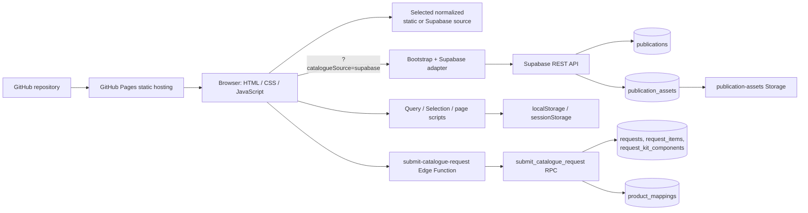
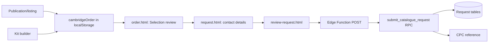
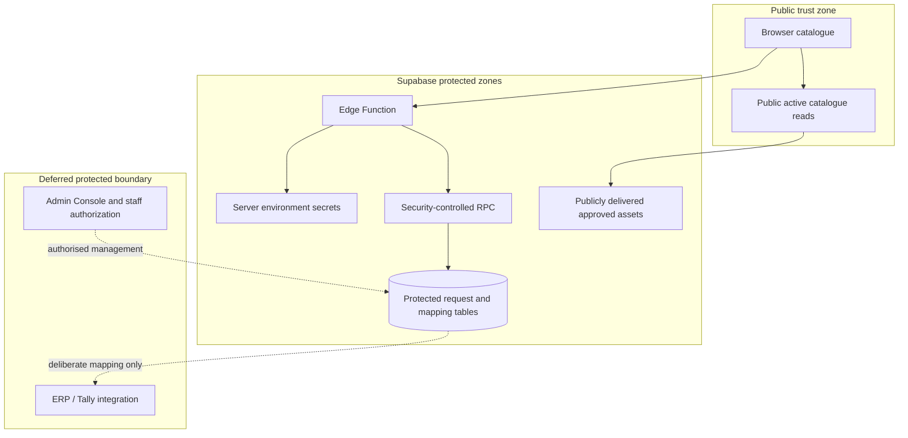
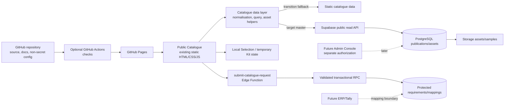

# CPC Digital Catalogue — Technical Design

> Current-state update: common catalogue-source routing, Browse filters/search/MRP, Custom Kit review/name/Playgroup support, and Standard Kit foundation are implemented. PDF/share/related-title features are deferred. Requirement hardening is prepared locally in `0f5bc96`, not deployed.

## Purpose and authority

This is the technical-design baseline for evolving the existing CPC Digital Catalogue. It translates the approved product, architecture, flow, UI/UX, and database direction into implementation boundaries. It is based on repository and recovered-backend evidence; it does not authorize code, database, deployment, or Supabase changes.

The existing application is the implementation baseline. The governing implementation rule is **preserve before replace**: retain working behaviour, incrementally improve clear seams, and replace only where a concrete product, security, or maintainability constraint makes that necessary.

## 1. Current verified application architecture

The public catalogue is a static multi-page HTML/CSS/browser-JavaScript application. It has no package manifest, build step, frontend framework, server application, test suite, or committed GitHub Actions workflow. The configured remote is `cpcbooks/digital-catalogue`; the public URLs and repository structure are consistent with GitHub Pages deployment.

### 1.1 Pages and routes

| Area | Existing pages/routes |
| --- | --- |
| Landing/discovery | `index.html`; Early Learning, School Learning, College and University, Competitive Exams landing pages |
| Listings | `browse.html`; stage/category listing pages including `early-learning-books.html`, `school-books.html`, `exam-preparation.html`, `college-books.html`, and `competitive-exam-books.html` |
| Publication | `book-details.html?id=…`, with optional `returnTo`, `catalogueSource`, legacy level/class context |
| Selection/requirement | `order.html`, `request.html` / `request-details.html`, `review-request.html` |
| Custom Kit | `kit-builder.html?level=nursery|lkg|ukg` |

The current route family contains legacy technical names such as `order.html`. That is a terminology/UI problem, not a reason to break existing URLs; any future rename should preserve redirects or compatibility.

### 1.2 Modules, styles, state, and configuration

| Layer | Verified implementation |
| --- | --- |
| Static catalogue | `js/catalogue-data.js` populates global `CAMBRIDGE_CATALOGUE`; current default source. |
| Query/data helpers | `catalogue-query.js` provides active/by-ID/category/class helpers; `catalogue-validator.js` checks the legacy data contract. |
| Supabase pilot | `catalogue-pilot-config.js`, `catalogue-bootstrap.js`, and `catalogue-supabase-adapter.js`; opt-in through `?catalogueSource=supabase`. |
| Page rendering | `catalogue-browse.js`, `book-details.js`, plus substantial inline scripts on listing, Kit, Selection, and requirement pages. |
| Selection | `catalogue-selection.js`; shared actions/floating pane and local `cambridgeOrder` state. |
| Requirement | Inline request/review page logic plus `request-submission.js`. |
| CSS | Shared `catalogue.css`, `publication-browser.css`, `selection-pane.css`, plus many page-local `<style>` blocks. |
| Browser state | `localStorage` holds Selection and request details; `sessionStorage` holds pilot cache and return context. |

Public configuration includes the Supabase URL and publishable key in `catalogue-pilot-config.js`. That is acceptable public configuration. The recovered Edge Function reads `SUPABASE_URL` and `SUPABASE_SERVICE_ROLE_KEY` only from server-side environment variables; no secret value was found in the browser source.

### 1.3 Current architecture diagram



## 2. Current request and data flows

### Catalogue browse

```text
Browser → page script → CambridgeCatalogueQuery → CAMBRIDGE_CATALOGUE
→ client-side filter/render → publication card/detail URL
```

`browse.html` awaits bootstrap, renders active records, supports category/class/series/subject/type filters and multi-term text matching. Listing pages outside the general Browse route frequently use their own inline filtering/rendering. The current general Browse route reads URL parameters at initial load but does not keep all subsequent interaction state synchronised to the URL.

### Supabase catalogue pilot

```text
Browser (?catalogueSource=supabase)
→ catalogue-bootstrap (10-minute session cache)
→ catalogue-supabase-adapter
→ REST GET publications + publication_assets
→ legacy-shaped browser records
→ existing query/detail renderer
```

The adapter uses two public REST reads, joins assets in the browser, and translates the database shape into the legacy record contract. `browse.html` and `book-details.html` load this pilot sequence. Most category/stage pages still load the static data directly, so the pilot is not yet a complete application-wide source switch.

### Selection, Custom Kit, and requirement



`catalogue-selection.js` stores Selection snapshots and quantities, with return-context handling. The Custom Kit flow supports Playgroup/Nursery/LKG/UKG, configurable completion rules, optional names, Builder → Review → Edit, and completed-Kit Selection compatibility. Kit PDF and sharing remain deferred.

`request-submission.js` POSTs the submission DTO to the Edge Function, which invokes the transactional RPC. Commit `0f5bc96` prepares strict DTO validation, canonical snapshots, Kit validation, and idempotency locally; it is not deployed. Rate limiting remains pending verification of the private attempts store.

## 3. Existing architecture assessment

| Area | What works | Limitations | Decision | Target direction and why |
| --- | --- | --- | --- | --- |
| Static multi-page frontend | Fast, simple, deployable without a runtime; existing discovery routes work. | Page scripts/styles duplicate patterns. | **KEEP / REFINE** | Retain the delivery model; consolidate only repeated shared behaviour. |
| HTML/CSS/vanilla JS | Appropriate size and straightforward Pages deployment. | More discipline is needed for reusable render/state code. | **KEEP / REFINE** | No evidence that a framework is required for the public catalogue. |
| Shared query/selection modules | Useful existing seams and legacy-data contract. | Some page-local code bypasses them. | **KEEP / EXTEND** | Strengthen these seams rather than inventing a repository framework. |
| Static catalogue master | Works as a fallback and supports current pages. | Changing content requires source edits; it cannot be the long-term data master. | **REPLACE gradually** | Supabase becomes authoritative only after complete migration/verification. |
| Supabase adapter | Sensible compatibility adapter that protects UI from immediate schema change. | Opt-in source selection still fetches broad rows and relies on the legacy browser contract. | **KEEP / EXTEND** | Use as the transition seam across all publication-driven public routes. |
| Page-local catalogue renderers | Preserve specialised current journeys. | Duplicate filters/card rendering and diverge from pilot/data contract. | **REFINE** | Extract only common rendering/normalisation pieces with regression checks. |
| GitHub Pages | Fits static public browsing, direct links, and asset delivery. | Cannot securely render per-publication social metadata or run server code. | **KEEP / REFINE** | Supabase Edge Functions cover trusted writes; static-host limits inform only future features. |
| GitHub Actions | No workflow is present. | No visible automated validation/deploy verification. | **EXTEND** | Add lightweight checks later; retain Pages deployment approach. |
| Request boundary | Edge Function + RPC transaction/reference is a correct direction. | Prepared hardening is not deployed; rate-limit design remains unverified. | **KEEP / REFINE** | Integrate the prepared boundary with approved pilot testing; do not replace it with a Node backend. |
| Storage/assets | DB metadata plus Storage bucket supports multiple assets. | Adapter currently uses cover/back/sample-page URLs only. | **KEEP / EXTEND** | Resolve ordered samples/PDFs through a focused asset helper. |

## 4. Frontend technology decision

**The existing HTML/CSS/JavaScript architecture remains appropriate for the public CPC Digital Catalogue. A frontend rewrite is not required, and a framework migration is not required.**

The public experience has a finite route set, modest shared state, simple browser-local Selection/Kit state, and realistic scale of hundreds/thousands—not complex client collaboration, SSR dashboards, or a rich account application. Vanilla JavaScript can support filtering, sample viewing, Custom Kit, and requirement forms when shared modules are improved incrementally. It also suits GitHub Pages with no build or runtime dependency.

The practical improvement is modest modularisation: one catalogue normalisation/data-access boundary, reusable publication card/detail/asset helpers, Selection state ownership, Kit state/validation helpers, and a small configuration module. This reduces duplication without a big-bang rewrite. A future secured Admin Console may justifiably use another architecture, but it does not require migrating the public catalogue.

## 5. Hosting and deployment

GitHub Pages should remain for the public static catalogue. Its strengths are low operational complexity, cacheable static assets, direct URLs, and compatibility with the current repository. The repository currently has no tracked workflow configuration, so no GitHub Actions deployment process can be verified from source.

Refine later with a minimal workflow for syntax/lint-like checks, link/static checks, and a controlled deployment verification if CPC elects to use Actions. GitHub Pages limitations are material only for features requiring dynamic server rendering: personalised pages, secret-backed operations, and rich per-publication Open Graph metadata. They do not block catalogue browsing, Supabase public reads, client PDF generation, or Edge Function submission. Do not replace Pages solely for common industry preference.

## 6. Data-source and access-layer evolution

| Phase | Source | Technical position |
| --- | --- | --- |
| Current | Unified normalized static or Supabase source | Preserve the explicit source choice and operational fallback while validation continues. |
| Transition | Adapter normalises Supabase `publications`/`publication_assets` into one browser contract | Expand only after parity checks cover every current route and representative data. |
| Target | Supabase authoritative publication master | The frontend reads a customer-safe catalogue data layer; static data is retained only until cutover proof is complete, then retired deliberately. |

Safe sequence: define/verify the target schema and public projection; complete data/assets and compare counts/representative routes; make one common loader available to all listing/detail pages; test static/Supabase parity and error fallback; set the chosen source through reviewed public configuration; only then deprecate static master data. Never remove fallback merely because a pilot query succeeds.

The adapter is already a useful source boundary. Keep its mapping responsibility, but gradually move the legacy record shape toward a documented normalized frontend contract. Avoid scattered direct REST calls in page scripts. At current scale, two cached GETs and browser-side joining/filtering are acceptable; pagination or narrower select projections should follow measured catalogue size and asset volume.

## 7. Configuration, URLs, rendering, search, and filtering

### Configuration

Keep public URL/publishable key, non-secret source selection, branding/copy references, and non-sensitive rollout flags in a small reviewed client configuration module. Keep service role/database credentials/access tokens solely in server-side Supabase secret management. Catalogue year, logo path, hero copy, common labels, and source flags should be centralised where practical; publication records must not be moved into UI configuration.

Early Learning stage eligibility/minimum belongs in data/configuration governed by the schema design, not the Kit page's hard-coded `kitConfig`. Public feature rollout may hide unfinished UI, but never authorises a protected backend action.

### Routing and deep links

Preserve `index.html`, `browse.html`, and `book-details.html?id=…` where practical. Continue carrying permitted return context and source parameter during the transition. `book-details.js` already restricts `returnTo` to known relative catalogue routes, which is a useful safety pattern. Future browse/filter URL updates should use `history.replaceState`/`pushState` deliberately so copy/back/forward/QR routes reproduce useful context without redirect loops.

Future Kit URLs must not expose PII. A compact encoded state can support short-lived local/share scenarios only if length, tampering, versioning, and canonical publication validation are handled; true durable/restorable Kit links require deferred server persistence with unpredictable identifiers and expiry/access design. Existing `order.html` URLs should remain compatible during terminology cleanup; route aliases/redirects are safer than blind renames.

### Publication rendering and assets

Target shared responsibilities:

- normalise catalogue records and stable UUIDs once at the data boundary;
- resolve customer-safe primary cover, ordered assets, missing cover fallbacks, MRP/classification display, and sample availability in one asset helper;
- use one reusable card renderer with optional action slots where listing context permits;
- keep page-specific grouping/navigation in page modules;
- make detail lookup use canonical publication UUID, then render cards/assets/actions from shared helpers.

`book-details.js` presents front cover, back cover, and ordered sample pages in one gallery. A separate sample viewer/action and sample-PDF path are not required. Sharing and related-title actions are deferred.

### Search and filters

Keep client-side filtering initially. Browse searches title, series/family, subject, type, medium, category, class, SKU, and ISBN, with combined filters, URL state, chips, reset, and no-results recovery. Supabase-side search is only needed if measured catalogue scale requires it.

Preserve the existing combined-filter logic. Separate technical filtering state from mobile presentation: mobile can use a sheet/control while applying the same query model. Add URL state persistence, clear/reset, active chips, no-result recovery, and bounded result rendering incrementally. Do not introduce external search infrastructure without evidence.

## 8. Selection and Early Learning Custom Kit

### My Selection

Keep device-local My Selection for launch. Current `cambridgeOrder` snapshots contain identifier/title/classification/cover/MRP/quantity data, survive cross-page browsing, enforce 1–10,000 quantities, and drive a floating shortcut. Improve it by treating the stable publication UUID as the primary key, re-resolving current active catalogue data before display/submission where possible, flagging stale/inactive titles without discarding unaffected work, and separating user-facing “Selection” vocabulary from legacy state/internal names.

When changing the local key/shape, provide a one-time read-and-migrate path so existing selections remain usable. No server-side Selection table is justified.

### Custom Kit

Keep the current focused builder concept—stage-specific titles, selection count/progress, and adding a Kit into My Selection—but **extend** it substantially:

- include Playgroup and restrict all Kit entry/building to configured eligible Playgroup/Nursery/LKG/UKG records;
- get minimum distinct-title rule from configured stage data (current value eight, nullable/configurable later);
- retain in-progress state locally, preserve it across ordinary navigation, and allow review/edit even below the minimum;
- persist selected stable publication IDs and quantities, not only mutable whole-book snapshots;
- provide a distinct review model with optional Kit name; validate completion at UI for guidance and again at trusted submission;
- keep a Kit separate from the general Selection even when it is submitted through the common requirement flow.

The existing `kit-builder.html` has `div` click cards rather than semantic controls, hard-coded stage/minimum values, and completion-gated “Add Kit to Selection”; it cannot satisfy the approved incomplete-review or data-driven scope without extension. This is an extension/refinement, not a framework replacement.

### Deferred PDF and Kit sharing

Custom Kit PDF and sharing are deferred/post-launch. Do not add persistence or a generation dependency for them.

## 9. Requirement submission and Edge Function boundaries

| Zone | Target responsibility |
| --- | --- |
| Browser | Collect necessary contact fields; hold local draft; guide user validation; submit publication UUIDs, Kit stage, quantities, and harmless intent data; preserve data on failure. |
| Edge Function | Public HTTP/CORS boundary; reject malformed/oversized requests; rate-limit/bot-check/idempotency boundary; avoid PII/secrets in logs; invoke only trusted database work. |
| Database RPC | Transaction; canonical catalogue/mapping lookup; authoritative snapshot/reference/counts; lifecycle and completed-Kit rule validation; write request header/items/components atomically. |

Keep the existing Edge Function + transactional RPC, rather than replace it with a new backend. Refine it to validate before expensive processing where possible, ensure configured Kit minimum/eligibility is applied server-side, call a safely recovered rate-limit mechanism or its replacement, add bot protection after threat analysis, and support idempotent retry. The Edge Function currently creates its service-role client only server-side; that boundary is correct. The recovered rate-limit helper mutates private attempt data and is not in the verified call path, so it needs verified recovery and Security Design before adoption.

The client `request-submission.js` should eventually construct a minimal intent payload rather than a broad mutable record spread. Browser-side master lookup is UX only; authoritative title/SKU/ISBN/MRP/mapping snapshots must come from the server/database. Success should clear local drafts only after confirmed reference; failure/timeout should preserve Selection/contact data and make duplicate-submit state clear.

## 10. Error handling, performance, caching, accessibility, and analytics

### Failure patterns

- Static fallback/pilot load failure: explain the failed source and retain usable static browsing when that source is selected/configured to fall back.
- Invalid publication/asset/sample: show a truthful unavailable state and a contextual catalogue route; do not render broken actions.
- Stale Selection/Kit: revalidate active UUIDs on rendering/submission, identify unavailable records, preserve unaffected items.
- Requirement errors/timeouts: retain draft, disable repeated active submit while pending, provide retry guidance, and distinguish a known reference from unknown completion.
- Analytics failure: silently non-blocking.

### Performance and caching

Static HTML/CSS/JS and covers already benefit from browser/GitHub Pages caching; card images use `loading="lazy"` in shared browsing/selection paths. The pilot caches normalized records in `sessionStorage` for ten minutes. Keep this as a bounded optimisation, add a schema/source version to cache invalidation when source becomes authoritative, and never cache PII/request drafts beyond deliberate local state.

Use appropriate image dimensions/formats and lazy loading; load sample images only when needed; avoid rendering an unbounded catalogue DOM; measure Supabase payload/asset counts before adding pagination, prefetching, CDN products, Redis, or a dedicated search service. Storage objects remain files; database asset metadata drives rendering.

### Accessibility implementation seams

Preserve semantic `article`, heading, link, form-label, and live-region patterns already present. Maintain visible focus, use labelled quantity controls, announce dynamic result/count/error changes, keep image alternative text and missing-asset fallbacks, and ensure error summaries and fields are programmatically connected. No formal certification claim is made.

### Analytics boundary

No analytics/tracking provider or event implementation was found. Future code should call one optional, central boundary such as `trackCatalogueEvent(eventName, minimalMetadata)` from domain actions, not scattered vendor SDK calls. Events remain aggregate/minimal, exclude customer form content and persistent behavioural identity, and never block a user action. Provider choice is deferred.

## 11. Admin, ERP, security, source control, and testability

The future Admin Console is a separate protected application boundary. It may share Supabase tables/assets but needs different authentication, authorisation, UI, and possibly deployment choices. Do not force the public static catalogue into an admin framework, and do not choose an Admin technology yet.

Future ERP boundary remains `publication UUID → product_mappings → external identifier`. The catalogue remains independently usable; no ERP client, polling, stock, price, or order logic belongs in the public application now.



Source control should contain frontend source, documentation, non-secret reviewed configuration, Supabase migrations/functions/tests when created, and workflow definitions. It must not contain service roles, database credentials, access tokens, customer/request data, or Storage object exports. Recovery snapshots remain evidence, not migrations. `supabase/schema/remote-public.sql` is currently zero bytes and cannot be treated as a schema source.

The repository has 56 Node tests covering key catalogue, Kit, source, and submission seams. Retain focused synthetic tests and add approved pilot integration checks for the prepared Requirement boundary; a sophisticated browser automation framework is not required for launch.

## 12. Current → target technical matrix

| Area | Current implementation | Decision | Target | Reason |
| --- | --- | --- | --- | --- |
| HTML pages | Static multi-page routes | **KEEP / REFINE** | Preserve URLs and enrich shared behaviour | Fits public catalogue and Pages. |
| CSS | Shared base plus page-local styles | **REFINE** | Centralize repeated patterns/tokens gradually | Duplication risks divergence, not a rewrite reason. |
| JavaScript | IIFE globals, shared modules, inline page scripts | **KEEP / REFINE** | Incremental domain modules | Adequate platform; duplicated code needs boundaries. |
| GitHub Pages | Static public hosting | **KEEP / REFINE** | Continue Pages; add validation process later | Meets current public requirements. |
| GitHub Actions | No workflow recovered | **EXTEND** | Add lightweight checks when approved | Missing verification automation. |
| Catalogue source | Unified normalized static/Supabase boundary | **KEEP / REFINE** | Supabase master after verified parity; static development/reference fallback. | Avoid permanent duplicate business logic. |
| Supabase client | Fetch-based pilot adapter | **KEEP / EXTEND** | Narrow public catalogue loader/projection | Existing seam is useful. |
| Catalogue adapters | One legacy adapter | **KEEP / EXTEND** | Shared normalized contract across pages | Prevent per-page data-source branches. |
| Publication cards | Shared CSS but multiple renderers | **REFINE** | Shared card/action/fallback helpers | Duplication produces inconsistent cards. |
| Browse/search | Client-side general Browse | **KEEP / EXTEND** | URL state, more searchable fields, measured server assist | Sufficient at current scale. |
| Filters | Combined filters, URL state, chips, reset, mobile controls | **KEEP / REFINE** | Manual accessibility/mobile verification. | No separate mobile sheet required. |
| Publication detail | Detail script/unified gallery | **KEEP** | Canonical lookup and manual regression. | Sharing/related actions are deferred. |
| Samples | Unified front/back/ordered sample-page gallery | **KEEP** | Verify assets and accessibility/manual regression. | No separate viewer or PDF requirement. |
| My Selection | `cambridgeOrder` local state | **KEEP / REFINE** | UUID-first, stale validation, legacy-key migration | Local state fits launch. |
| Custom Kit | Configurable P/N/L/U builder/review/name flow | **KEEP / REFINE** | Final data/rule configuration and manual regression. | PDF/sharing deferred. |
| Requirement UI | Multi-step local pages | **KEEP / REFINE** | Product wording, minimal intent payload, duplicate recovery | Existing flow/persistence useful. |
| Edge Function | CORS POST → service role RPC | **KEEP / REFINE** | Validation, abuse/idempotency/logging hardening | Correct trusted boundary, incomplete controls. |
| Database RPC | Atomic insert/reference/snapshots | **KEEP / REFINE** | Canonical data/Kit rule validation | Correct transaction location. |
| Storage | Public bucket plus metadata | **KEEP / EXTEND** | Asset resolver and reviewed delivery policy | Supports target assets. |
| Configuration | Inline branding plus pilot config | **REFINE** | Central public presentation/feature configuration | Maintainability, no CMS. |
| Analytics | None recovered | **DEFER** | Optional central event boundary | Provider/retention undecided. |
| Admin | No console | **DEFER** | Separate secured application | Planned, not public-catalogue dependency. |
| ERP boundary | Mapping fields only | **KEEP / DEFER** | Preserve UUID/mapping boundary | No current ERP master. |

## 13. Components proposed for replacement

### Static source as the long-term publication master

- **Current implementation:** `js/catalogue-data.js` is the default authoritative browser dataset.
- **Exact problem:** normal publication/taxonomy/asset/lifecycle changes require source changes and the static shape diverges from the recovered publication master. This conflicts with the approved dynamic catalogue requirement.
- **Why refine/extend is insufficient:** adding more static helpers cannot make editorial data administration independent of source deployment.
- **Replacement:** Supabase-authoritative public catalogue records delivered through the existing adapter/data layer, with static fallback retained during measured migration.
- **Migration risk:** incomplete data/asset parity or page-specific static assumptions could regress routes. Mitigate with comparison reports, representative flow tests, staged source selection, and reversible fallback.

No other major architectural replacement is currently justified. In particular, neither the plain HTML/CSS/JavaScript frontend, GitHub Pages, nor the Edge Function/RPC submission approach needs replacement.

## 14. Evolved target architecture



## 15. Evolution principles and dependencies

Implementation must normally follow:

1. protect current working journeys and establish verification around them;
2. consolidate only demonstrated shared boundaries;
3. resolve security prerequisites and target schema additions;
4. complete and verify Supabase catalogue/assets;
5. transition frontend reads route by route with fallback;
6. verify approved samples, Kit, and Requirement controls;
7. verify mobile/accessibility/error behaviour;
8. retire legacy data/paths only after their replacements are proven.

This is a dependency order, not permission to implement. It avoids big-bang rewrites and prevents database/data cutover from being coupled unnecessarily to visual redesign.

## 16. Open technical questions

- At what observed catalogue/asset size should the client-side search/filter path become database-assisted?
- Should public asset delivery use stable URLs, generated URLs, or a controlled resolver once Storage migration is complete?
- Which privacy-conscious analytics provider, if any, fits CPC's retention and consent decisions?
- Which architecture and deployment boundary is justified for a future Admin Console?
- How should GitHub Pages cache invalidation/versioning be managed when catalogue updates become routine?

## 17. Documentation alignment and current conflicts

The approved documents are mutually aligned on catalogue-first scope, Early Learning-only configurable Custom Kit, local Selection/working-Kit preference, MRP as information, no mandatory login, and future ERP separation.

PDF and sharing are deliberately deferred/post-launch; they do not create a current technical decision.

Current remaining gaps are primarily pilot-data coverage, final manual regression/accessibility verification, final Kit compositions, and approved integration of prepared Requirement hardening/rate limiting. Static remains a deliberate fallback; PDF/share/related-title features are deferred.

## Document status

Status: Initial technical-design baseline based on existing implementation

Date: 2026-09-29

Product authority: [docs/01-product-requirements.md](01-product-requirements.md)

Architecture authority: [docs/02-system-architecture.md](02-system-architecture.md)

Behavioural authority: [docs/03-user-flows.md](03-user-flows.md)

UI/UX authority: [docs/04-ui-ux-specification.md](04-ui-ux-specification.md)

Database authority: [docs/05-database-schema.md](05-database-schema.md)

Implementation evidence: actual repository source, `supabase/recovery/`, and `supabase/functions/`
