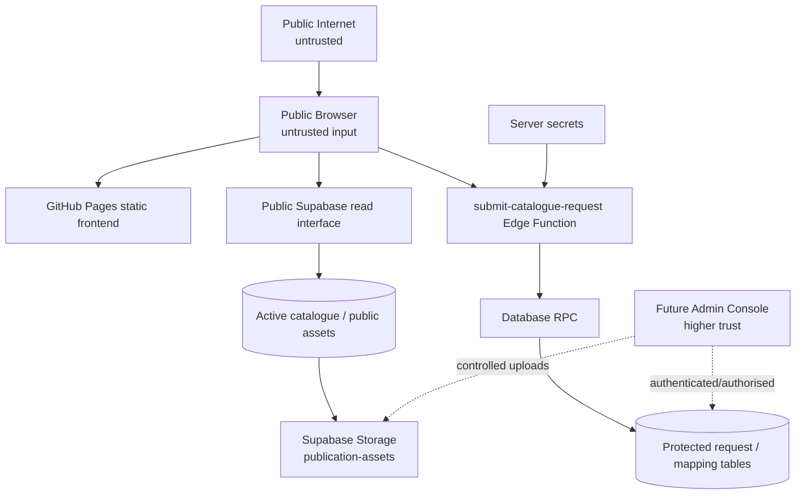

# CPC Digital Catalogue — Security & Privacy

> Current-state update: `0f5bc96` prepares strict Requirement DTO/canonical validation, Kit validation, and idempotency locally. These changes are not deployed; rate limiting remains unresolved pending verification of the private attempts store.

## Purpose and scope

This document defines proportionate security and privacy direction for the existing CPC Digital Catalogue. It is based on recovered Supabase metadata and repository source, not on production data queries or active testing. It does not create policy SQL, modify application code, or change any remote object.

The catalogue is intentionally public. Security therefore protects customer/requirement information, administrative capability, catalogue integrity, backend resources, credentials, and reasonable service availability—not public catalogue covers, intended public samples, MRP, or bibliographic information.

Principles are least privilege, defence in depth, server authority for sensitive writes, data minimisation, secure defaults, explicit trust boundaries, graceful failure, and a minimal public attack surface. Controls must be practical for a public educational catalogue rather than disproportionate enterprise infrastructure.

## 1. Trust and threat model

| Boundary | Input / exposure | Allowed operation | Primary risk | Required control direction |
| --- | --- | --- | --- | --- |
| Internet → browser | Untrusted URLs, form values, third-party navigation | Public browsing | Malformed links, client manipulation, XSS | Validate/encode data, safe navigation, no security decisions in UI. |
| Browser → GitHub Pages | Public static files | Serve frontend | Static content tampering through repository/deploy process | Repository access control, reviewed deployment, future checks. |
| Browser → Supabase read API | Public URL/publishable key and query input | Read intended active catalogue/assets | Reading inactive/internal/customer rows | Narrow grants plus RLS policies and public read projection. |
| Browser → Edge Function | Anonymous JSON request | Requirement submission only | Spam, malformed/oversized payloads, duplicates | Structural/semantic validation, limits, rate limits, idempotency, bot protection where justified. |
| Edge Function → RPC | Trusted server invocation | Canonical validation and transaction | Excessive `SECURITY DEFINER` authority | Restricted EXECUTE, safe search path, least privilege, authoritative lookup. |
| RPC → protected tables | Customer PII/mappings/snapshots | Atomic approved writes | Disclosure or integrity loss | RLS, narrowed grants, no public table reads/writes. |
| Public Storage | Intended public files | Read intended assets | Direct URLs / accidental private upload | Public bucket contains public files only; separate protected bucket for private/admin files. |
| Future Admin | Staff data/actions | Controlled catalogue/asset/requirement administration | Privilege escalation, unsafe upload/write | Authentication, authorisation, auditability, least privilege, separate trust boundary. |

## 2. Data classification

| Class | Examples | Handling direction |
| --- | --- | --- |
| Public catalogue | Active publications, covers, intentionally public samples, MRP, bibliography/classification | May be read anonymously; remain accurate and lifecycle-controlled. |
| Internal operational | Product mappings, Tally/ERP identifiers not meant for display, backend configuration metadata | Do not expose through public API/read model. |
| Personal/requirement | Name, phone, optional email, institution, submitted requirement, reference, customer snapshots | Collect only for Send Requirement; protect from public read/write and minimise retention. |
| Secret | Service-role credential, DB credentials, CLI/deployment tokens, future admin secrets | Server/platform secret store only; never repository/browser/log/document values. |
| Analytics | Minimal aggregate catalogue events | Separate from PII; no behavioural profiling or advertising use. |

## 3. Current public Supabase configuration

The browser configuration contains a Supabase project URL and publishable browser key. These are public configuration, not service-role credentials. Security must never depend on hiding them: a visitor can inspect any browser-delivered key and call exposed public APIs.

RLS, policies, grants, public projections, and trusted server-side writes must enforce access regardless of key visibility. No service-role value, database password, or CLI access token was found in the inspected frontend/recovery source. This is a verified repository finding, not proof that no secret exists outside repository scope.

## 4. Current RLS, policies, grants, and catalogue reads

### Current verified RLS/policy state

All recovered public tables have RLS enabled and not forced: `publications`, `publication_assets`, `product_mappings`, `requests`, `request_items`, and `request_kit_components`.

Only two public policies were recovered:

- `publications_public_read_active`: `anon` and `authenticated` may SELECT publications whose `status` is `Active`.
- `publication_assets_public_read_active`: `anon` and `authenticated` may SELECT active assets whose parent publication is active.

No public policy was recovered for mappings or any requirement table. Recovered relation grants show `anon`/`authenticated` SELECT (plus REFERENCES/TRIGGER/TRUNCATE metadata) only for `publications` and `publication_assets`; request/mapping tables list `postgres` and `service_role`, not anonymous browser roles. Based on this metadata, anonymous browser clients do not have a verified direct path to read or write requests, request items, Kit components, or mappings.

### Grants and default ACLs

Recovered default ACL records in `public` include broad defaults for `anon`, `authenticated`, and `service_role` over future relations/sequences/functions. Existing table grants are narrower than those defaults for request/mapping tables, and current RLS adds a separate row-control layer. This is a **verified least-privilege concern**, not evidence that customer rows are currently publicly readable.

Grants decide whether a role may attempt an operation; RLS/policies decide which rows an already-privileged role may access. Both must be deliberately narrow. RLS must not be used as an excuse for excessive grants or permissive defaults, because future tables/functions can inherit risky exposure patterns and RLS mistakes can convert excess grants into data exposure.

**Target:** anonymous/public clients can read only explicit active/catalogue-visible publication fields and appropriate active public asset metadata. They cannot read/write customer requirements, mappings, future Admin data, or secrets. Review and replace broad default ACLs and unnecessary existing public privileges before further public-schema expansion; do not change them in this task.

## 5. Storage security

Recovered metadata verifies a public `publication-assets` bucket with 10 MiB limit and allowed MIME types JPEG, PNG, WebP, and PDF. Storage `objects` and `buckets` have RLS enabled; no Storage policies were recovered.

A public bucket is compatible with covers, intended public imagery, and public samples. It means URLs may be directly reachable/predictable, so the bucket must contain only assets CPC intends to make public. It must not become a place for private drafts, customer files, internal sales material, or Admin-only documents. Future protected/admin assets should use a separate protected bucket/path model with explicit policy and upload controls.

## 6. Requirement submission endpoint

### Current verified controls

The recovered `submit-catalogue-request` Edge Function:

- accepts only POST and OPTIONS;
- requires JSON content type;
- rejects invalid JSON/non-object payloads;
- requires an object customer and 1–1,000 items;
- checks a 512,000-byte serialized payload limit after parsing;
- creates a Supabase client with server-side `SUPABASE_URL` and `SUPABASE_SERVICE_ROLE_KEY` environment variables;
- returns generalised client errors and `Cache-Control: no-store`;
- invokes `submit_catalogue_request(payload jsonb)` rather than directly writing each table.

The recovered RPC is `SECURITY DEFINER`, uses a controlled `search_path`, validates basic item type/quantity/title/Kit-component limits, generates a reference, maps internal fields where available, and inserts header/items/components in one transaction. Recovered EXECUTE grants for it list `postgres` and `service_role`, not `anon`/`authenticated`.

### Verified gaps

- No verified active rate-limit call path, CAPTCHA/bot control, or idempotency mechanism.
- The body is parsed before its serialized-size check, so the stated payload limit is not a pre-parse transport guard.
- Browser payload construction spreads client-controlled catalogue snapshots; the RPC resolves legacy mappings but does not yet verify target canonical publication UUID, lifecycle, Kit eligibility, or configurable Kit minimum.
- CORS permits `Access-Control-Allow-Origin: *`.
- Function error code/message is logged server-side. It does not log a full payload, but logging policy/redaction and correlation are not formalised.

## 7. Public endpoint abuse, rate limiting, CAPTCHA, and idempotency

Anonymous requirement submission is intentional, so reasonable abuse controls are a launch requirement. Risks include automated spam, database resource use, duplicate retry, malformed/oversized submissions, and bot traffic. The layered direction is: platform limits; strict structure/semantic validation; request/body/item/component limits; effective rate limit; low-friction bot challenge where risk warrants; idempotency; monitoring; and safe error handling.

### Rate limiting

Recovery includes `check_catalogue_request_rate_limit(ip, limit, window)`. It is `SECURITY DEFINER`, deletes expired records and inserts attempts into private metadata. It is not read-only and is not found called by the recovered Edge Function or submission RPC. The private attempt-table schema was outside recovery scope and is not inferred here.

Before activating, replacing, or trusting it, verify its private schema, indexes/retention, caller boundary, concurrency behaviour, IP/proxy source, privacy impact, error handling, grants, and whether it is invoked before expensive work. Store the minimum abuse-control data necessary and set a documented retention policy; do not collect unnecessary identifiers.

### CAPTCHA / bot protection

A privacy-conscious low-friction challenge should be evaluated before public launch because the endpoint accepts anonymous PII-bearing submissions. It should be adaptive/proportionate, accessible, avoid blocking normal catalogue/sample browsing, and be paired with server verification and rate limits—not treated as a standalone control. The exact vendor and whether it is always-on or risk-triggered remain open.

### Idempotency

Current retries after timeout/uncertain completion can create duplicate requirements. Use a client-generated opaque idempotency token per deliberate submission attempt, transmitted in the payload/header and recorded/uniquely constrained in the trusted submission path with bounded retention. It must be independent of customer/publication text, return the same safe result for a repeat token, and distinguish a new edited submission from a retry. This is preferable to unreliable matching on phone, title, or timestamp.

## 8. Server authority and Custom Kit integrity

The browser may submit intent—publication UUIDs, selected quantities, Kit stage, and optional Kit name—but is not authoritative for title, SKU, ISBN, MRP, classification, mapping, active status, or eligibility. The trusted RPC should canonicalise public UUIDs against current catalogue data, derive required display snapshots, generate the reference/counts, and reject inactive/unavailable records.

For a completed Early Learning Kit requirement, server validation must confirm configured stage, enabled/eligible publications, active status, distinct-title minimum (currently eight but configurable), component/line quantities, and canonical snapshots. Disabled buttons or hard-coded browser values are guidance only, never enforcement. This protects catalogue/operational integrity without introducing ordering behaviour.

## 9. Input validation and database-function security

Validation must cover both structure and semantics:

| Input | Target checks |
| --- | --- |
| Customer fields | Only needed name/phone and justified optional contact/institution fields; trim, type/length/format validation. |
| IDs/lines | UUID/known-publication verification, permitted type, item/component count and position. |
| Quantity | Integer, positive and bounded; validate at browser for UX and server/database for authority. |
| Kit | Stage, configured eligibility/minimum, distinct titles, quantities, canonical data. |
| Notes/unexpected fields | Length limits; reject or ignore unknown fields deliberately, never rely on client object shape. |
| Payload | Content type, parse safety, body/item/component size/count limits. |

`SECURITY DEFINER` functions need minimal authority, explicit safe search path, narrowly granted EXECUTE, validation before sensitive writes, and predictable generalised errors. The recovered submission function has a controlled `public, pg_temp` search path and transactional behaviour, but its public authority model/canonical lookup must be hardened. The rate helper needs separate verified recovery before any integration.

## 10. Requirement records and references

No inspected frontend route directly reads `requests`, `request_items`, or `request_kit_components` using anonymous credentials. RLS/policy/grant recovery also does not show anonymous access to them. That is a verified current protection boundary.

The `CPC-YYYYMMDD-XXXXXX` reference is a customer display/reference value, not an authentication or authorisation secret. It must not by itself grant requirement-detail access in future tracking: a predictable/date-visible prefix and finite suffix are unsuitable as proof of entitlement. Future tracking requires a separate secure verification/access design and anti-enumeration controls.

## 11. Browser state, DOM, URLs, CSP, headers, and CORS

### Local/session storage

Current `localStorage` holds `cambridgeOrder` (book/Kit snapshots and quantities) and `cambridgeRequestDetails` (contact/institution fields used by the requirement flow). This is a verified privacy exposure on a shared device and to any same-origin XSS; it is not a place for service-role keys or authentication secrets. Selection is justified device-local state; persisted requirement contact data should be minimised, cleared after confirmed submission, and only retained across form navigation where UX justifies it. `sessionStorage` holds return context and a ten-minute Supabase catalogue cache.

### XSS and DOM safety

The source commonly uses `textContent` and DOM APIs for dynamic catalogue data. Some page scripts use `innerHTML`; inspected Selection/review code escapes interpolated titles where it uses templates, and several `innerHTML` assignments are static markup followed by `textContent` population. No verified exploitable XSS path was established from this source inspection.

This is still a **potential risk** because catalogue data and future Admin-edited text are untrusted until rendered safely. Continue using DOM/text APIs; escape/sanitise only where deliberate HTML content is allowed; validate image/asset URLs; never interpolate raw user/catalogue input into HTML, event attributes, CSS, or executable URLs. Security testing must include malicious catalogue/contact/query input.

### URL and redirect safety

`catalogueSource`, filters, IDs, and route parameters are public state. `book-details.js` constrains `returnTo` to an allowlist of known relative catalogue pages, so no verified open redirect exists in that path. Continue encoding IDs/query values and validating future share/asset URLs. Do not treat a Kit/reference URL as authority.

### CSP and security headers

An incremental Content Security Policy is practical but must be tested: current pages rely heavily on inline scripts/styles, Supabase API/Storage, images, and PDFs. Begin with report/observe or a permissive transitional policy, inventory origins/nonces/hashes, then reduce inline execution as scripts/styles are modularised. Do not publish a strict policy that breaks the current static site.

GitHub Pages offers limited convenient per-response header control. `Referrer-Policy`, `Permissions-Policy`, frame protections, and MIME-sniffing protection should be evaluated through feasible Pages-compatible configuration or a future fronting layer only if risk/benefit justifies it. GitHub Pages is not itself a backend-security blocker and should not be abandoned merely for headers.

### CORS and CSRF

The Edge Function's `Access-Control-Allow-Origin: *` allows browser calls from any origin. This is a defence-in-depth concern for a public endpoint, but CORS is not authentication and restricting it does not stop direct scripted HTTP requests. Production origin allowlisting can reduce casual cross-origin use if local development/testing origins remain supported; validation, rate limits, and idempotency remain essential.

The current public endpoint uses JSON POST and no ambient cookie/session authentication. Conventional cookie-based CSRF is therefore not the primary threat model, and blindly adding CSRF tokens is not warranted. Reassess CSRF if a future Admin or authenticated cookie session is introduced.

## 12. Secrets, Git, dependencies, and Pages

Secrets—service role, DB passwords, Supabase CLI tokens, deployment credentials, and future Admin credentials—belong only in platform/local secret stores. They must never appear in browser JavaScript, committed environment files, manifests, screenshots, documentation, or routine logs. Public project URL/publishable key are intentionally separate.

The repository contains a Supabase `.gitignore`, linked CLI temporary metadata, recovery snapshots, and an untracked `asset-import/` directory. Recovery artifacts were designed to exclude table/object rows, but every generated export must still be reviewed and secret-scanned before source control. Local `.temp`, environment files, artifact imports, and future dumps need deliberate ignore/review rules. Introduce pre-commit/pre-push secret scanning later; no scanner is installed here.

Dependencies are minimal: no frontend package manager/build dependencies were recovered; the Edge Function imports `@supabase/supabase-js@2`. This small surface is worth preserving. Any future PDF or analytics library needs maintenance, licence, browser-security, bundle-size, and supply-chain review before addition.

Static GitHub Pages serves public content; it cannot safely hold backend secrets or replace RLS/server validation. Its limitations are separate from backend security and do not justify moving hosting without a concrete feature/security blocker.

## 13. Future Admin and uploads

Admin Console is a higher-trust planned capability. Before production it requires staff authentication, explicit authorisation/roles, narrow write permissions, session security, auditability, server-side validation, no service-role browser exposure, and CSRF protection if its auth model uses ambient cookies. No implementation/framework is selected here.

Future Admin uploads require allowed MIME and extension validation, size limits, generated/safe storage paths, controlled overwrite rules, active-publication association, scanning/handling policy for malicious files, and review of object exposure. JPEG/PNG/WebP/PDF are current public bucket types. SVG must receive special scrutiny if ever added because it can carry active content. Never upload private/internal material to the public catalogue bucket.

## 14. Analytics, logging, transparency, retention, and legal context

Analytics is optional and must remain aggregate/product-improvement oriented: minimal event data, no requirement contact details, no unnecessary persistent cross-site identifier, no behavioural advertising, and retention appropriate to CPC policy. Provider choice is deferred.

Operational logging should record enough to diagnose failures/abuse without complete customer payloads, credentials, or unnecessary contact data. The current Edge Function logs RPC error code/message; retain only safe diagnostics, redact where needed, and use a correlation ID for submission support/retry tracing without making it a customer-data identifier.

At Send Requirement, visitors need clear notice of what they are sending, why CPC needs it, and the purpose of processing. Final privacy notice, retention, consent/other lawful basis as applicable, rights handling, and vendor processing must be reviewed against applicable Indian law/current requirements before launch. This is a legal/operational decision, not a legal conclusion in this document.

Retention decisions are required for requirements/contact data, operational logs, rate-limit records, and analytics. No retention period is invented here.

## 15. Security testing and acceptance gates

Before public launch, test anonymous catalogue reads; RLS/direct REST access; denied request-table reads/writes; malformed/oversized payloads; item/quantity limits; invalid/inactive IDs; Kit eligibility/minimum bypass; duplicate retries; rate-limit/bot control; XSS payloads; URL manipulation; Storage access; secret scans; dependency review; browser/mobile failure/retry paths. Do not run active production penetration tests without separate approval.

Launch gates:

1. No service-role credential in frontend/repository; generated artifacts secret-scanned.
2. Anonymous users cannot read or directly write requirement/customer/mapping tables.
3. Public reads return only intended active/catalogue-visible records/assets.
4. Requirement endpoint has tested effective abuse controls and bounded request processing.
5. Trusted server derives/verifies authoritative publication facts and completed Kit rules.
6. Duplicate retries return one safe requirement outcome.
7. RLS/grants/Storage access regression tests pass.
8. Privacy notice/data collection and retention decisions are approved.

## 16. Security priority matrix

| Priority | Verified issue / requirement | Rationale |
| --- | --- | --- |
| **P0 — must fix before public launch** | Effective anonymous submission abuse controls; server-side canonical publication/active/Kit eligibility/minimum validation. | Public endpoint accepts PII-bearing submissions; current rate helper is inactive and client facts can influence records. |
| **P1 — should fix before public launch** | Idempotency; review/reduce broad default ACLs; minimise persisted request PII in local storage; confirm public Storage contains only intended assets; requirement error/log redaction policy. | Material integrity/privacy/operational risk, but no verified current customer-table exposure. |
| **P2 — defence in depth / near-term** | Tested CORS origin policy; incremental CSP/header strategy; DOM/URL hardening regression tests; source/cache/version hygiene. | Valuable hardening; no verified immediate exploit from inspected source. |
| **P3 — future / Admin** | Admin auth/RBAC/audit; protected uploads; lightweight requirement tracking verification; shared-Kit persistence security; analytics provider. | Planned capabilities, not current public-catalogue dependencies. |

### Expected high-priority areas assessed

| Area | Assessment |
| --- | --- |
| Ineffective request rate limiting | **Verified gap — P0.** Helper exists but no verified active call path. |
| Duplicate/idempotency protection | **Verified gap — P1.** No mechanism recovered. |
| Broad grants/default ACLs | **Verified concern — P1.** Current request tables have no anon grant/policy, but broad defaults are not least privilege. |
| Client-controlled catalogue snapshot | **Verified gap — P0.** Browser sends broad snapshots; target canonical lookup absent. |
| Custom Kit server validation | **Verified gap — P0 for completed Kit submissions.** Current builder is client-side/hard-coded; RPC lacks target config validation. |
| Secret exposure | **No verified issue.** Public browser configuration is not a service-role secret. Continue scanning. |
| Public requirement-table access | **No verified issue.** Current recovered policies/grants do not give anon read/write access. |
| XSS path | **Potential risk — P2.** Dynamic `innerHTML` exists but no proven exploitable injection found. |
| Future uploads | **Future requirement — P3.** Current bucket is public and only permits stated public types. |

## 17. Current → target security matrix

| Area | Current verified state | Risk | Target | Priority | Phase |
| --- | --- | --- | --- | --- | --- |
| Browser configuration | Public URL/publishable key | Key cannot be secret boundary | RLS/grants enforce access | P1 | Catalogue transition |
| RLS | Enabled on six public tables; only active read policies recovered | Future policy/grant drift | Explicit active/catalogue-visible read model | P1 | Security hardening |
| Grants/default ACLs | Request tables no anon grants; defaults broad | Future accidental exposure | Least-privilege grants/defaults | P1 | Security hardening |
| Storage | Public 10 MiB JPEG/PNG/WebP/PDF bucket | Accidental public content | Public files only; protected uploads separate | P1 | Asset/admin design |
| Edge Function | POST/JSON/basic limits/service role server-side | Abuse/input/logging gaps | Hardened ingress boundary | P0 | Submission hardening |
| RPC | Transaction/basic checks/controlled path | Client facts/Kit rules not canonical | Server-derived snapshots/config validation | P0 | Schema/submission evolution |
| Rate limit | Helper exists but inactive/private schema unrecovered | Spam/resource abuse | Verified effective minimal-data limiter | P0 | Security hardening |
| Bot control | None recovered | Automated spam | Proportionate accessible challenge if needed | P0 | Launch readiness |
| Idempotency | None recovered | Duplicate requirements | Opaque per-attempt token | P1 | Submission hardening |
| Canonical publication validation | Legacy mapping lookup only | Integrity/snapshot mismatch | UUID/lifecycle canonical lookup | P0 | Schema/submission evolution |
| Custom Kit validation | Browser applies configurable development rules; remote validation is not yet deployed | Scope/minimum bypass | Deploy and integration-test configurable server enforcement | P0 | Prepared hardening |
| Local storage | Selection and request details persisted | Shared-device/same-origin exposure | Minimise/clear PII; keep Selection local | P1 | UX/security refinement |
| XSS | Mostly DOM/text APIs; some `innerHTML` | Future unsafe interpolation | Safe rendering discipline/tests | P2 | Ongoing |
| CORS | Wildcard origin | Casual cross-origin use | Review origin allowlist with dev support | P2 | Hardening |
| CSP/headers | No repository evidence of custom policy | Browser hardening gap | Incremental tested policy | P2 | Hardening |
| Secrets | No service-role value found in source | Future accidental commit | Secret stores/scanning | P0 gate | Ongoing |
| Logging | RPC code/message logged | PII/error leakage if expanded | Redaction/correlation policy | P1 | Hardening |
| Analytics | None recovered | Future surveillance/data mixing | Minimal optional boundary | P3 | Deferred |
| Admin | Not implemented | High-trust future surface | Auth/RBAC/audit/uploads | P3 | Admin project |
| Uploads | Public bucket types recovered | Unsafe future admin upload | Controlled protected upload design | P3 | Admin project |

## 18. What not to do

Current requirements do not justify customer accounts for browsing, mandatory login, hiding the public browser key, leaving GitHub Pages solely for security theatre, encrypting public catalogue data, collecting more PII for abuse control, invasive fingerprinting, surveillance analytics, a WAF solely because one exists, or disproportionate enterprise security infrastructure.

## 19. Open security questions

- What verified rate-limit mechanism and minimum-data retention model should CPC use?
- Should a bot challenge be always-on, risk-triggered, or introduced after measured abuse?
- What idempotency token lifetime and retry UX are appropriate?
- What CSP/header deployment options can be tested without disrupting GitHub Pages/static inline content?
- Which analytics provider, if any, meets CPC's privacy/retention requirements?
- What retention periods and staff access controls are required for requirements and rate-limit records?
- What future Admin authentication/session/authorisation model is appropriate?

## 20. Document status

Status: Initial Security & Privacy baseline

Date: 2026-09-29

Authorities:

Product: [docs/01-product-requirements.md](01-product-requirements.md)

Architecture: [docs/02-system-architecture.md](02-system-architecture.md)

Flows: [docs/03-user-flows.md](03-user-flows.md)

UI/UX: [docs/04-ui-ux-specification.md](04-ui-ux-specification.md)

Database: [docs/05-database-schema.md](05-database-schema.md)

Technical: [docs/06-technical-design.md](06-technical-design.md)

Security evidence: actual repository source, `supabase/recovery/`, and `supabase/functions/`
