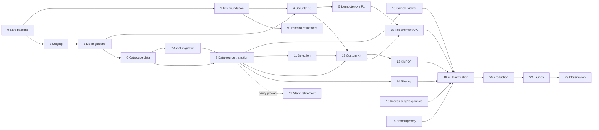

# CPC Digital Catalogue — Implementation Plan

## 1. Objective and operating principle

Bring the existing CPC Digital Catalogue from its current pilot/development state to a secure, tested, maintainable public-launch state while preserving working architecture and behaviour wherever practical. The product remains a **Digital Catalogue**, not an online ordering portal: My Selection and Send Requirement are supporting catalogue capabilities, and Custom Kit is a differentiated Early Learning capability.

The governing principle is **preserve before replace**:

```text
Existing working application → protect → test → refine → extend
→ migrate incrementally → verify → retire legacy only when safe
```

This is a plan only. It does not approve implementation, migrations, package installation, or any remote change.

## 2. Current implementation baseline

- A static HTML/CSS/JavaScript public application is deployed through GitHub Pages; no committed GitHub Actions workflow is verified.
- `js/catalogue-data.js` is the static/transitional catalogue master. Supabase pilot reads are available in Browse and Book Details through bootstrap/adapter modules, using publication UUIDs and `publication_assets`.
- Browser-local Selection, an inline Early Learning Custom Kit (currently Nursery/LKG/UKG and hard-coded minimum eight), and a requirement UI already exist.
- Requirement submission uses the deployed `submit-catalogue-request` Edge Function and transactional `submit_catalogue_request(jsonb)` RPC.
- Recovered backend evidence records publication, asset, mapping, request, request-item, and request-Kit-component structures; it does not include production rows or the private rate-limit metadata schema.
- Current verified security gaps include no effective active submission rate limiting, no idempotency, client-supplied catalogue snapshots, no server Kit eligibility/minimum enforcement, broad default ACLs needing review, and browser persistence of requirement details.
- No committed automated test infrastructure, test runner, browser automation, or verified Supabase test/staging project exists.

## 3. Categories and phase rules

| Category | Meaning |
| --- | --- |
| **Launch essential** | Required to meet approved core product, security, data, or release-gate obligations. |
| **Launch recommended** | High-value quality or resilience work; complete before launch unless an explicit, documented risk disposition is accepted. |
| **Post-launch** | Valuable improvement that must not delay a safe catalogue launch. |
| **Future / deferred** | Requires a later product or technical decision. |

Every phase below includes objective, why now, dependencies, expected local/remote scope, approval boundary, tests, acceptance criteria, rollback/recovery, and a stop/review checkpoint. The listed files are expected touchpoints, not permission to change them now.

## 4. Phase 0 — Safe baseline and source control

**Category:** Launch essential
**Objective / why now:** establish an auditable, secret-free checkpoint before implementation begins.

| Item | Plan |
| --- | --- |
| Dependencies | Existing checkpoint tag/branch and recovery evidence. |
| Expected local scope | Review docs 01–09, `supabase/recovery/`, downloaded function, `supabase/config.toml`, `.gitignore`, and generated artifacts. Do not treat all `supabase/` content as automatically committable. |
| Remote scope | None. |
| Explicit approval | Required before staging/committing; separate approval for any deletion or `.gitignore` change. |
| Tasks | Secret/sensitive-data review; confirm `.temp` exclusions; classify recovery snapshots as evidence rather than migrations; preserve `asset-import/` as untracked input until separately reviewed; make a clean intentional commit/checkpoint. |
| Tests | Secret scan, `git status`, tracked/untracked ownership review. |
| Acceptance | Only reviewed non-secret source, configuration, docs, recovery evidence, and function source enter Git; no customer rows/secrets are committed. |
| Rollback / checkpoint | Existing `checkpoint/pre-refactor-2026-09-29`; new baseline commit only after review. |
| Stop / review | User approves exact staged files and commit. |

## 5. Phase 1 — Minimum test foundation

**Category:** Launch essential
**Objective / why now:** protect present behaviour before changing data boundaries or UI structure.

| Item | Plan |
| --- | --- |
| Dependencies | Phase 0 clean baseline. |
| Expected local scope | Pure modules such as query, validator, Selection, request-payload logic; synthetic fixtures and a minimal test configuration selected after a small proof of fit. |
| Remote scope | None. |
| Explicit approval | Local implementation approval; package installation only if separately approved. |
| Tasks | Extract only stable test seams as needed; cover catalogue normalisation, search/filter, Selection quantities/persistence, Kit completion, payload construction, and data validation. |
| Tests | Unit/module tests plus current-browser manual smoke. |
| Acceptance | Repeatable failures/successes for high-risk existing logic without a framework rewrite. |
| Rollback / checkpoint | Small isolated commits; preserve existing behaviour through regression suite. |
| Stop / review | Review test tool choice and first test results before refactoring. |

## 6. Phase 2 — Test/staging backend

**Category:** Launch essential before risky remote changes
**Objective / why now:** provide a safe environment for migrations, RLS, Storage, RPC, and Edge Function verification.

| Item | Plan |
| --- | --- |
| Dependencies | Phase 0; approved project/account ownership; recovered schema evidence. |
| Expected local scope | Environment separation documentation, non-secret configuration patterns, source-controlled definitions once established. |
| Remote scope | A separate Supabase project, schema/policies/grants/functions/Storage configuration, synthetic publications/requirements/assets only. |
| Explicit approval | **Yes—before project creation and each remote configuration/deployment group.** |
| Tasks | Recreate only verified/reviewed backend structures; use test secrets outside Git; establish test asset bucket configuration; document objects recovery cannot reproduce automatically, including private rate-limit metadata and production data. |
| Tests | RLS/grant direct checks, RPC/Function integration, synthetic submission, asset access, migration rehearsal. |
| Acceptance | Reproducible backend with no real customer/request data copied from production. |
| Rollback / checkpoint | Delete/recreate only the approved staging resource if necessary; never use production reset as a shortcut. |
| Stop / review | Confirm staging parity and recovery limitations before any production-oriented migration work. |

## 7. Phase 3 — Database baseline and migrations

**Category:** Launch essential
**Objective / why now:** convert reviewed current/target definitions into additive, source-controlled migrations without destroying current production structures.

| Item | Plan |
| --- | --- |
| Dependencies | Phase 2 staging and migration rehearsal; docs 05 and 07 decisions. |
| Expected local scope | `supabase/migrations/`, schema tests, reviewed config/function source. |
| Remote scope | Staging first; production only later with separately approved migration groups. |
| Explicit approval | **Yes** for every migration, RLS, GRANT/REVOKE, function, Storage, and production data action. |
| Tasks | Model additive lifecycle/visibility, `early_learning_stage_config`, configurable Kit eligibility/minimum, constraints/indexes/functions/triggers/RLS/policies/grants; preserve publications, assets, mappings, requests, request items, and Kit components. Backfill, verify, transition, then clean up only when safe. |
| Tests | Schema diff, constraints, counts/relationships, RLS/grants, function regression, rollback rehearsal. |
| Acceptance | Existing UUIDs and historical requirements remain valid; no destructive table recreation or schema reset. |
| Rollback / checkpoint | Backup/recovery confirmation, reviewed rollback path, per-migration verification. |
| Stop / review | Staging results and exact production migration plan reviewed. |

## 8. Phase 4 — Security P0 backend

**Category:** Launch essential
**Objective / why now:** close the verified gaps that permit anonymous submission abuse or browser-controlled catalogue facts.

| Item | Plan |
| --- | --- |
| Dependencies | Phases 2–3; approved server/configuration design. |
| Expected local scope | Edge Function/RPC/migration tests and minimal client payload adjustments. |
| Remote scope | Staging then approved production function/database/security changes. |
| Explicit approval | **Yes** for functions, database functions, policies, grants, or remote configuration. |
| Tasks | Add effective anonymous abuse control; retain and test payload limits; canonical server lookup; lifecycle validation; Early Learning stage/eligibility validation; configured Kit-minimum validation. Evaluate low-friction bot protection after rate-limit design, rather than treating it as a substitute. |
| Tests | Malformed/oversized payload, invalid/inactive UUID, manipulated title/MRP/SKU/ISBN/stage, Kit bypass, rate-limit threshold/recovery, transaction rollback. |
| Acceptance | Browser submits intent only; protected server/database determines authoritative catalogue facts and valid completed Kit state. |
| Rollback / checkpoint | Versioned function/migration rollback, staging proof, production backup/recovery plan. |
| Stop / review | Docs 07 P0 and docs 08 Gate E evidence reviewed before proceeding. |

## 9. Phase 5 — Idempotency and security P1

**Category:** Launch recommended; idempotency and ACL remediation should be treated as pre-launch unless an explicit risk disposition is accepted.

| Item | Plan |
| --- | --- |
| Dependencies | Phase 4 security boundary. |
| Expected local scope | Submission UI/payload, function/RPC, test suite, logging/configuration review. |
| Remote scope | Approved staged grants/default ACLs, function/database changes, Storage content review. |
| Explicit approval | **Yes** for grants, policies, functions, Storage, or database changes. |
| Tasks | Implement retry-safe idempotency; remediate broad grants/default ACLs; minimise browser-stored request PII; redact logs; inventory public bucket content and distinguish public catalogue assets from future protected assets. |
| Tests | Double click/timeout/retry, effective privileges, protected-table denial, log inspection with synthetic data, public asset checks. |
| Acceptance | One logical submission does not create unintended duplicates; grants are least privilege; customer data is not unnecessarily retained in browser/logs. |
| Rollback / checkpoint | Small independently reversible security changes and privilege regression tests. |
| Stop / review | P1 disposition and evidence recorded. |

## 10. Phase 6 — Catalogue data completion

**Category:** Launch essential
**Objective / why now:** make Supabase capable of becoming the authoritative publication master without invented/hard-coded product data.

| Item | Plan |
| --- | --- |
| Dependencies | Staging schema/security baseline; approved data mapping. |
| Expected local scope | Reviewed import/mapping manifests and validation reports; no uncontrolled source edits. |
| Remote scope | Approved staging and later production catalogue metadata import. |
| Explicit approval | **Yes** for production import/change. |
| Tasks | Preserve UUIDs; migrate/validate Playgroup, Nursery, LKG, UKG, later stages/classes, series, subject, medium, SKU, ISBN, MRP, descriptions, lifecycle/visibility, and data-driven Kit eligibility. |
| Tests | Required fields, identifier rules, taxonomy consistency, search/filter result quality, orphan/mapping validation. |
| Acceptance | No hard-coded counts; data supports approved discovery, assets, lifecycle, and Kit rules. |
| Rollback / checkpoint | Import batches, mapping review, count/integrity reports, backup/recovery plan. |
| Stop / review | Catalogue owner approves data-quality and parity report. |

## 11. Phase 7 — Asset migration

**Category:** Launch essential where catalogue assets/samples are represented
**Objective / why now:** associate verified public media with catalogue records safely.

| Item | Plan |
| --- | --- |
| Dependencies | Phase 6 mapping and approved public asset policy. |
| Expected local scope | Read-only review of `asset-import/`; reviewed asset manifest/scripts/configuration only after separate approval. |
| Remote scope | Staging then approved production Storage uploads and `publication_assets` metadata. |
| Explicit approval | **Yes** for uploads, Storage configuration, metadata import, overwrite, or cleanup. |
| Tasks | Map covers/back covers/sample images/PDFs; set Storage paths, MIME/size validation, primary asset, sort order, active status, duplicate prevention, and broken-link checks. |
| Tests | Direct public delivery, missing/broken assets, ordered samples, no unintended non-public files, associations/primary uniqueness. |
| Acceptance | No bulk upload before publication mapping is verified; optional asset absence does not break a publication. |
| Rollback / checkpoint | Batch manifest, object/version inventory, no uncontrolled overwrite, reversible metadata change. |
| Stop / review | Asset coverage and public-content review signed off. |

## 12. Phase 8 — Frontend data-source transition

**Category:** Launch essential
**Objective / why now:** transition gradually from static master to a verified Supabase master through existing adapter seams.

| Item | Plan |
| --- | --- |
| Dependencies | Phases 6–7 and parity fixtures. |
| Expected local scope | Bootstrap/adapter/query/detail/browse modules and controlled source selection. |
| Remote scope | No new remote change expected beyond already-approved catalogue data/assets. |
| Explicit approval | Local implementation approval; production source cutover approval separately. |
| Tasks | Enable routes incrementally; preserve static fallback during verification; exercise homepage, Browse, details, search/filters, samples, Selection, Kit, and deep links. |
| Tests | Static/Supabase parity matrix and user-flow regression. |
| Acceptance | Supabase route behaviour/data parity passes before source authority changes. |
| Rollback / checkpoint | Feature/source switch and retained static fallback temporarily. |
| Stop / review | Explicit approval before declaring static master non-authoritative. |

## 13. Phase 9 — Frontend structural refinement

**Category:** Launch recommended
**Objective / why now:** improve maintainability only where tests demonstrate safe boundaries.

- **Dependencies:** Phase 1 and, for data-bound rendering, Phase 8.
- **Expected local scope:** duplicated rendering, problematic inline styles/scripts, shared non-secret configuration, URL/filter state, asset resolution, error states, stale browser state, and legacy cart/order terminology.
- **Remote scope / approval:** none expected; local implementation approval applies.
- **Tasks:** make small modules/components shared where duplication causes defects or blocks approved capabilities. Do not migrate to React or another framework.
- **Tests / acceptance:** preserve URLs where practical, navigation/context, responsive cards, Selection state, and existing catalogue flow; each refinement is regression-tested.
- **Rollback / checkpoint:** isolate changes by responsibility; stop after each coherent refactor rather than a broad cleanup.

## 14. Phase 10 — Sample viewer completion

**Category:** Launch essential
**Objective:** complete core in-catalogue sample viewing by extending the existing asset presentation.

- **Dependencies:** Phase 7 assets and Phase 8 data access.
- **Expected scope:** publication detail/sample-viewer modules and shared accessibility/error styles; no new heavy platform by default.
- **Remote scope:** none beyond approved asset metadata/delivery.
- **Tasks:** support ordered sample images and available PDF samples; honest no-sample, loading, failure, close/back, mobile, and keyboard behaviour.
- **Tests / acceptance:** sample paths work without login/contact collection; missing optional samples do not produce broken actions.
- **Rollback / checkpoint:** retain existing gallery behaviour until the replacement path passes regression; review before enabling across all records.

## 15. Phase 11 — My Selection completion

**Category:** Launch essential
**Objective:** refine device-local Selection without turning it into a cart.

- **Dependencies:** Phase 1; Phase 8 for canonical metadata refresh.
- **Expected scope:** `catalogue-selection.js`, selection pane/review/request hand-off and any safe legacy state migration.
- **Remote scope / approval:** none expected.
- **Tasks:** use publication UUIDs, quantities, cross-page persistence, stale/inactive handling, metadata refresh, contextual Continue Browsing, and safe transition to Send Requirement.
- **Tests / acceptance:** refresh/corruption/stale-item/quantity/mobile paths pass; no required contact data before Send Requirement; terminology remains Selection.
- **Rollback / checkpoint:** preserve old state during migration where safe; review compatibility before removing legacy keys.

## 16. Phase 12 — Early Learning Custom Kit completion

**Category:** Launch essential
**Objective:** extend—not replace—the existing builder into a data-driven Early Learning capability.

- **Dependencies:** Phases 3–4, 6, 8, and 11.
- **Expected scope:** Kit builder/review, local state, configuration/data access, requirement hand-off, server validation.
- **Remote scope:** approved configuration/schema/function work already covered by Phases 3–4.
- **Tasks:** add Playgroup; restrict scope to eligible Playgroup/Nursery/LKG/UKG records; configurable per-stage minimum (current default eight); review/edit below minimum; completed state; optional Kit name; persistence and stale-item recovery.
- **Tests / acceptance:** incomplete review remains available; completed actions obey configured server-validated rule; ineligible/stage-mismatched records cannot enter a completed Kit.
- **Rollback / checkpoint:** retain builder behaviour until eligibility/configuration parity is proven; review per stage.

## 17. Phase 13 — Custom Kit PDF Summary

**Category:** Launch essential
**Objective:** create the intended branded catalogue summary, not a quotation, invoice, purchase order, or checkout document.

- **Dependencies:** Phase 12 completed Kit rules; a short technical proof-of-concept if PDF approach remains unresolved.
- **Expected scope:** client or trusted generation approach chosen from docs 06 alternatives, Kit review, styling/assets, tests.
- **Remote scope:** none by default; any server rendering/dependency requires separate approval.
- **Tasks:** include CPC branding, stage, optional name, selected titles/covers where practical, MRP as catalogue information, multi-page/mobile handling, filename and failure recovery.
- **Tests / acceptance:** readable branded PDF with long/missing data cases; no payable total/order framing; no requirement submission prerequisite.
- **Rollback / checkpoint:** feature remains unavailable rather than emitting misleading output; proof-of-concept review before broad implementation.

## 18. Phase 14 — Sharing

**Category:** Publication sharing is launch essential; true restorable Kit sharing is launch recommended only if approved scope does not require new speculative persistence.

- **Dependencies:** stable publication deep links; Phase 12 for Kit context.
- **Expected scope:** native Share and Copy Link fallback, URL validation, page metadata where supported.
- **Tasks / acceptance:** share publications first; recipient lands in the right catalogue context. For Kit, prefer an approved non-persistent scope (for example, summary sharing) if true restorable links require new server state; defer durable shared-Kit records until explicitly approved.
- **Tests / rollback:** native/fallback sharing, mobile/desktop, invalid links, no order/requirement creation; retain standard direct links if optional sharing fails.
- **Stop / review:** resolve launch scope for restorable Kit links before adding persistence.

## 19. Phase 15 — Requirement UX completion

**Category:** Launch essential
**Objective:** complete the secure, accessible Send Requirement experience.

- **Dependencies:** Phases 4–5, 11–12.
- **Expected scope:** request/review/success UI, payload and error handling, local PII minimisation, privacy notice/copy.
- **Remote scope:** only already-approved secure submission boundary work.
- **Tasks:** review, necessary contact fields, validation, pending/double-submit state, CPC reference, retry/recovery, mobile and accessibility. Maintain Send Requirement/Requirement Reference terminology.
- **Tests / acceptance:** timeout/retry does not silently lose work or duplicate requests; failure preserves recoverable Selection/Kit; no checkout/payment/shipping language.
- **Rollback / checkpoint:** preserve existing working submit path until replacement integration passes staging.

## 20. Phase 16 — Accessibility and responsive polish

**Category:** Launch essential for core flows
**Dependencies:** feature phases above; expected local HTML/CSS/JS changes only.

Implement and verify semantic landmarks/headings, keyboard/focus, dialogs/sheets, filters, sample viewer, forms/status/errors, and mobile/tablet/desktop layouts. Each core flow must pass the docs 08 responsive and accessibility matrix. Review at a dedicated checkpoint; do not postpone a core accessibility defect to after launch.

## 21. Phase 17 — Analytics

**Category:** Post-launch unless a minimal, privacy-preserving implementation is proven low risk before launch.

Establish a single event boundary for aggregate catalogue visit/search/filter/publication/sample/Selection/Kit/requirement-success events. Do not collect customer contact data, invasive fingerprints, or behavioural-advertising profiles. Provider selection remains open. Analytics failure must never block browsing or submission.

## 22. Phase 18 — Branding and copy finalisation

**Category:** Launch recommended
**Dependencies:** UI features stable; CPC pre-launch brand/content review.

Finalise logo/top-left identity, hero copy, labels, navigation wording, and catalogue year through centralised repeated presentation values where practical. This must not redesign catalogue data or business logic. Review mobile/accessible treatments and preserve current baseline where approved.

## 23. Phase 19 — Full test and security verification

**Category:** Launch essential
**Dependencies:** all intended launch feature/security/data changes in staging.

Execute docs 08: automated regression; RLS/grants; server authority; Kit bypass; idempotency; rate limit/bot control if used; XSS-safe strings; privacy; responsive/accessibility/browser/performance; data parity; Storage; secret scan. No launch proceeds while required release gates fail. Remote test actions require staging approval; production checks remain limited to approved non-destructive smoke.

## 24. Phase 20 — Production migration and deployment

**Category:** Launch essential
**Dependencies:** Checkpoint G and explicit production approval.

Perform small approved groups only: backup/recovery confirmation, exact migration review, database migration, function deployment, Storage/config change if required, frontend deploy, and smoke tests. Each group needs explicit approval; do not combine unrelated production changes. Rollback distinguishes frontend revision, database migration/data recovery, function version, and Storage metadata/object recovery—Git revert alone is not database rollback.

## 25. Phase 21 — Static-master retirement

**Category:** Post-launch / after production parity
**Dependencies:** approved Supabase authority, parity results, production stability.

Disable static master as authority only after phased route verification. Retain a defined rollback path temporarily, monitor catalogue failures, and remove legacy data/access only after a later explicit review. Do not delete static data merely because Supabase is populated.

## 26. Phase 22 — Launch and Phase 23 — observation

**Category:** Launch essential / post-launch
Use docs 08 Gates A–K for GO/NO-GO; deployment is not proof of readiness. After launch, observe availability, load errors, broken assets, submission failures, abuse indicators, performance, and user feedback without surveillance. Escalate data/security faults through the incident/recovery process.

## 27. Post-launch and future work

**Post-launch:** richer aggregate analytics, durable Custom Kit sharing, lightweight requirement tracking, and further catalogue-management automation.

**Future / deferred:** secure Admin Console, richer catalogue-management features, ERP integration, and a separate future ordering portal if CPC approves it. The public launch does not depend on these. Do not add checkout, payments, inventory, invoices, customer accounts solely for browsing, invasive analytics, framework migration, microservices, Docker infrastructure, or workflow tools without demonstrated need.

## 28. Dependency graph



Phases 1–2, then data/asset work and selected frontend refinement, can progress in parallel when their dependencies and approved environments exist. Security P0, data-source parity, full verification, and production approval remain on the critical path.

## 29. Checkpoints and approval boundaries

| Checkpoint | Required result |
| --- | --- |
| A — Safe source-controlled baseline | Reviewed docs/recovery/function/configuration, secret scan, intentional Git ownership. |
| B — Behaviour protected | Minimum regression foundation covers current critical logic. |
| C — Staging reproducible | Separate test backend works with synthetic data only. |
| D — Security P0 | Abuse, canonical lifecycle, and Kit validation pass in staging. |
| E — Supabase parity | Catalogue/assets/data parity approved before authoritative cutover. |
| F — Core features | Samples, Selection, Kit, PDF, sharing scope, requirement UX, accessibility complete. |
| G — Release gates | Docs 08 A–K evidenced; P1 findings resolved or approved with safeguards. |
| H — Production verified | Approved migration/deployment and non-destructive smoke succeed. |

Explicit approval is required before creating/deleting a staging or production resource; migrations; RLS/GRANT/REVOKE; function deployment; Storage configuration/upload; production data import; DNS/hosting change; production deployment; or destructive cleanup. Local source edits are only within the separately approved phase scope.

## 30. Data safety and rollback principles

- Preserve UUID identity, existing valid relationships, and historical requirement snapshots.
- Never copy production customer/request data to staging, reset a schema, recreate tables as a shortcut, or perform uncontrolled Storage overwrite.
- Validate mappings, record counts/relationships, and use batches for data/assets.
- Maintain distinct rollback plans: frontend revision; database migration/data recovery; Edge Function version; Storage metadata/object restoration.
- Confirm backup/recovery capability before production actions; do not claim it from source inspection alone.

## 31. Definition of done

Launch completion requires catalogue browsing across Playgroup through the required upper catalogue levels; verified Supabase-authoritative catalogue data/assets; samples where supplied; public MRP; working Selection; eligible Early Learning Custom Kit with configurable rules and review; branded Kit PDF; secure Send Requirement and reference; P0 passed; P1 disposition; responsive/accessibility/privacy baseline; docs 08 release gates; and understood rollback/recovery.

Admin Console, ERP, ordering portal, payments, inventory, invoicing, and customer accounts are not launch requirements.

## 32. Implementation tracker

| Phase | Scope | Priority | Dependencies | Remote change? | Approval required? | Testing gate | Status |
| --- | --- | --- | --- | --- | --- | --- | --- |
| 0 | Safe baseline | Essential | Existing checkpoint | No | Commit review | Secret/ownership | NOT STARTED |
| 1 | Test foundation | Essential | 0 | No | Tool approval if needed | Current regression | NOT STARTED |
| 2 | Staging | Essential | 0 | Yes | Yes | Synthetic integration | NOT STARTED |
| 3 | Migrations | Essential | 2 | Yes | Yes | Schema/RLS rehearsal | NOT STARTED |
| 4–5 | Security | Essential/recommended | 1–3 | Yes | Yes | Docs 07/08 | NOT STARTED |
| 6–8 | Data/assets/source transition | Essential | 2–5 | Yes for data/assets | Yes | Parity | NOT STARTED |
| 9–18 | Frontend/features/polish | Mixed | 1, 8 as relevant | Normally no | Per phase | Functional/UX | NOT STARTED |
| 19 | Full verification | Essential | Launch scope complete | Staging only | Test approval | Gates A–K | NOT STARTED |
| 20–23 | Production/launch/observation | Essential/post-launch | 19 | Yes | Yes | Smoke/monitor | NOT STARTED |

## 33. First implementation sprint after approval

**Objective:** reach Checkpoint A and begin Checkpoint B without altering public behaviour or remote systems.

**Exact scope:** review and intentionally source-control docs/recovery/function/non-secret configuration; verify `.gitignore` and sensitive artifacts; select the smallest viable test approach; add initial synthetic fixtures and tests for catalogue normalisation, query/filter predicates, Selection quantities, Custom Kit completion predicate, and request-payload validation. Do not redesign UI, migrate frameworks, create staging, migrate production, or bulk import assets.

**Expected components:** documentation/recovery review, `.gitignore` only if separately approved, current pure JavaScript modules and new test files/configuration only after tool approval. **Tests:** secret scan, Git ownership review, initial repeatable unit checks, manual homepage/Browse/Selection/Kit/request smoke. **Checkpoint:** user reviews the exact baseline commit and test proof before any backend or structural work.

## 34. Plan maintenance

This plan guides safe work rather than authorising it automatically. If source evidence contradicts it, stop and review. If a simpler safe route is proven, update the plan. If product behaviour changes, update the relevant authority document rather than silently diverging.

## 35. Document status

Status: Initial implementation baseline

Date: 2026-09-29

Authorities:

Product: [docs/01-product-requirements.md](01-product-requirements.md)
Architecture: [docs/02-system-architecture.md](02-system-architecture.md)
Flows: [docs/03-user-flows.md](03-user-flows.md)
UI/UX: [docs/04-ui-ux-specification.md](04-ui-ux-specification.md)
Database: [docs/05-database-schema.md](05-database-schema.md)
Technical: [docs/06-technical-design.md](06-technical-design.md)
Security: [docs/07-security-privacy.md](07-security-privacy.md)
Testing: [docs/08-testing-launch-readiness.md](08-testing-launch-readiness.md)

Implementation evidence: actual repository, `supabase/recovery/`, and `supabase/functions/`.
